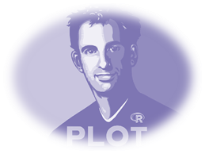
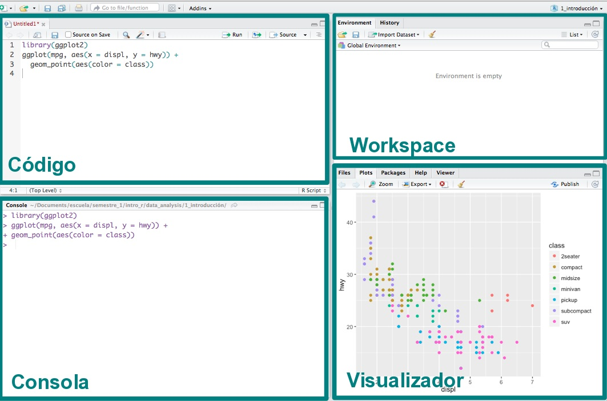
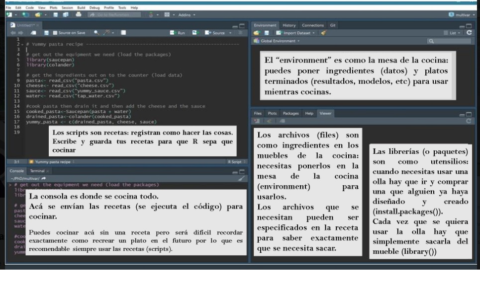
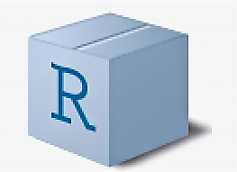
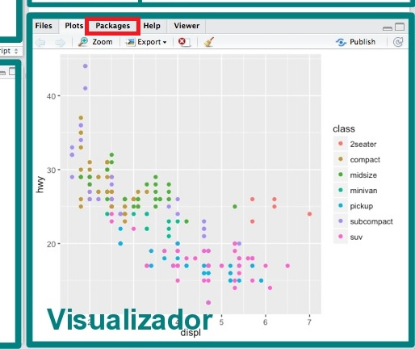
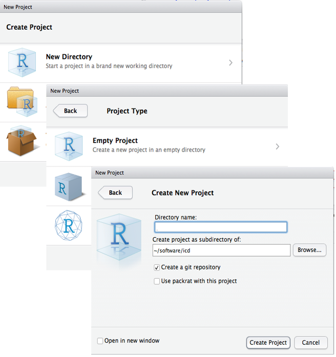
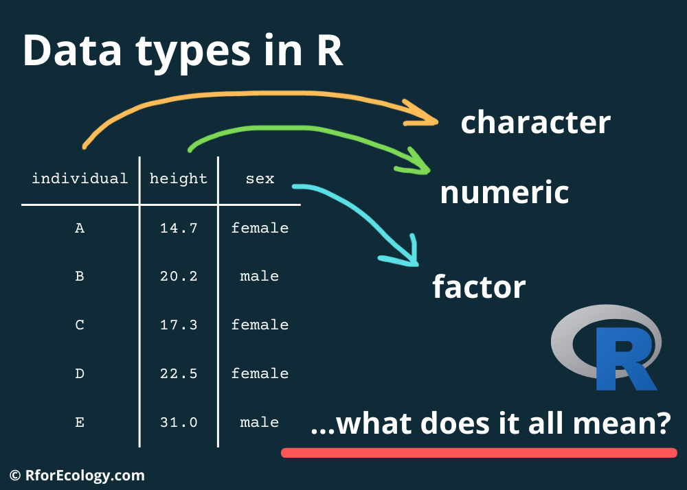
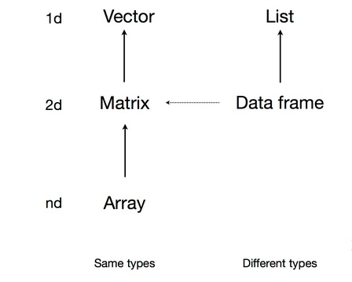
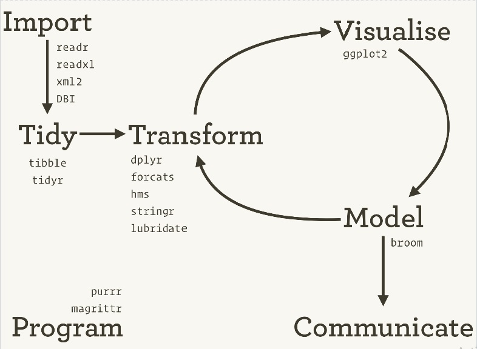

layout: true

```{r setup, include=FALSE}
library(flipbookr)
```

```{css, eval = TRUE, echo = FALSE}
.remark-code{line-height: 1.5; font-size: 90%}
@media print {
  .has-continuation {
    display: block;
  }
}
```

---


#.large[.fontone[.left[.opaco[Introducción a R y Tidyverse:]]]]

### .center[.large[.fontone[.red[Importación y manipulación de datos]]]]


<br>
<br>


### .right[.opaco[.extralarge[<br>.fontone[Zulemma Bazurto Blacio  <br> New Dimensions | 2023]]]]


---
background-image: url("fig/Fondo - 2023.PNG")
background-size: cover
class: center, center, top


## .weight[.fontone[.nd[.left[Agenda]]]]
<br>

--

### .left[.fontone[.opaco[Introducción a herramientas]]]

<div class="left fontone opaco large">
<ul style="list-style-type: none">
<li>RStudio y sus ambientes</li> 
<li>Buenas prácticas en R</li>
<li>Tipos de datos</li>
<li>Estructuras de datos</li>
</ul>
</div>

--

### .left[.fontone[.opaco[Los primeros pasos en análisis de datos]]]

<div class="left fontone opaco large">
<ul style="list-style-type: none">
<li>El proceso de tidyverse</li> 
<li>Importando datos con R</li>
<li>Exploración y manipulación de datos</li>
</ul>
</div>


---
background-image: url("fig/Fondo - 2023.PNG")
background-size: cover
class: center, center, top


## .weight[.fontone[.nd[.left[¿Qué es R?]]]]

<div class="left fontone opaco large">
<p>

"Lenguaje de programación para entender los datos" Hadley Wickham, Chief Scientist, Rstudio
</p>
</div>


--

## .weight[.fontone[.nd[.left[¿Por qué R?]]]]

<div class="left fontone opaco large">

<ul style="list-style-type: disc">
<li>Software libre</li> 
<li>De código abierto</li>
<li>Flexible</li>
<li>Con contribución de la comunidad</li>
</ul>
</div>


---
background-image: url("fig/Fondo - 2023.PNG")
background-size: cover
class: center, center, top


## .weight[.fontone[.nd[.left[R-Ecosistema]]]]

--

<div class="left fontone opaco large">
<ul style="list-style-type: disc">
<li>Paquetes libres y pagados que extienden las capacidades de R</li> 
<br>
<li>Software de análisis basado en R</li>
<br>
<li>Interfaces gráficas de desarrollo (IDEs)</li>
<br>
<li>Interfaces gráficas de usuario (GUIs)</li>
<br>
<li>Integración de Bases de datos con R</li> 
<br>
<li>Integración de herramientas de BI con R</li> 
</ul>
</div>

---
background-image: url("fig/Fondo - 2023.PNG")
background-size: cover
class: center, center, top


## .weight[.fontone[.nd[.left[RStudio]]]]

--

<div class="left fontone opaco large">
<ul style="list-style-type: disc">
<li>Dato curioso: Antes era el nombre de la compañía que creaba/desarrollaba productos de software. ¡Hoy Posit!</li> 
<br>
--

--
<li>El producto más conocido es RStudioIDE (Integrated Developed Environment)</li>
</ul>
</div>

--


---
background-image: url("fig/Fondo - 2023.PNG")
background-size: cover
class: center, center, top


## .weight[.fontone[.nd[.left[¡Echando a andar RStudio!]]]]
### .left[.fontone[.opaco[En windows y Mac]]]

<div class="left fontone opaco large">
<ol>
<li>R (base): Comprehensive R Archive Network (CRAN) <br> https://cran.r-project.org/</li> 
<br>
<li>RStudio IDE: https://www.rstudio.com/products/rstudio/download/</li>
</ol>
</div>


---
## .center[.fontone[.nd[¿Podemos instalar primero RStudio IDE y luego R (base)?]]]

<div style="text-align: center">

</div>

---
background-image: url("fig/Fondo - 2023.PNG")
background-size: cover
class: center, center, top


## .weight[.fontone[.nd[.left[En Linux (Distribuciones)]]]]

<div class="left fontone opaco large">
<ul style="list-style-type: disc">
<li>Distribuciones basadas en Debian/Ubuntu tienen R en los repositorios oficiales</li> 
<br>
<li>Distribuciones basadas en Fedora/RedHat deben habilitar EPEL para tener R</li>
<br>
<li>En Debian Estable para tener nuevas versiones se debe utilizar un ["backports"]</li>
</ul>
</div>

#### .left[.fontone[.opaco[Pero antes necesitamos instalar: (https://cran.r-project.org/bin/linux/debian/)]]]


---
background-image: url("fig/Fondo - 2023.PNG")
background-size: cover
class: center, center, top


## .weight[.fontone[.nd[.left[Ventajas de R-Studio]]]]

--

<div class="left fontone opaco medium">
<ul style="list-style-type: disc">
<li>Todo en 1 ventana: Console, Workspace, History, Working directory, Files, Plot, Packages y Help</li> 
<br>
<li>Integración de la consola de R</li>
<br>
<li>Ejecutar código desde script</li>
<br>
<li>Resaltado de sintaxis</li>
<br>
<li>Completado de sintaxis</li>
<br>
<li>Manejo de proyectos con soporte para Git y Subversion</li>
<br>
<li>Herramientas para Investigación Reproducible (knitr)</li>
</ul>
</div>

---
background-image: url("fig/Fondo - 2023.PNG")
background-size: cover
class: center, center, top


### .left[.fontone[.opaco[Si abres RStudio debe lucir así:]]]
<br>
<br>



### .left[.fontone[.opaco[Éstos son los llamados 'Ambientes de RStudio']]]

---
background-image: url("fig/Fondo - 2023.PNG")
background-size: cover
class: center, center, top


## .weight[.fontone[.nd[.left[Ambientes de RStudio: una amigable analogía]]]]
<br>
<br>




---
background-image: url("fig/Fondo - 2023.PNG")
background-size: cover
class: center, center, top


## .weight[.fontone[.nd[.left[¿Qué es un paquete?]]]]

--

<div class="left fontone opaco">
<ul style="list-style-type: disc">

<li>Contienen datos, funciones y códigos.</li> 

--
<br>
<li>En analogía, son como aplicaciones para celulares.</li>
<br>

--
<li>Existen aproximadamente 19679 paquetes disponibles en CRAN que abordan una amplia gama de tópicos.</li>
</ul>
</div>

--

### .left[.fontone[.opaco[Instalemos algunos:]]]

<br>
<br>
<br>
<br>
<br>
<br>
<br>
<br>
<br>
<br>
<br>
<br>
<br>
<br>

```{r chunk-1, eval=FALSE, message=FALSE, warning=FALSE, echo=TRUE}
install.packages("tidyverse",repos = 'http://cran.us.r-project.org')
install.packages("dplyr",repos = 'http://cran.us.r-project.org')
install.packages("animation",repos = 'http://cran.us.r-project.org')
```

---
background-image: url("fig/Fondo - 2023.PNG")
background-size: cover
class: center, center, top


<br>
<br>
<br>
<br>
<br>
<br>
<br>
<br>

<div class="left fontone opaco">
<center><font size="15pt"> ¿Sabes qué acabas de hacer? 

--
<br> .nd[Escribir tus primeras líneas de código en R. ¡Buen trabajo!]</font>
</div>

---
background-image: url("fig/Fondo - 2023.PNG")
background-size: cover
class: center, center, top


## .weight[.fontone[.nd[.left[Pero, ¿puedes instalar paquetes de otra manera?]]]]

<br>
<br>

### .extra[.left[.fontone[.opaco[Vamos nuevamente al ambiente que denominamos "Visualizador"]]]]




---
background-image: url("fig/Fondo - 2023.PNG")
background-size: cover
class: center, center, top


## .weight[.fontone[.nd[.left[¿Cuál es la diferencia entre un error y un warning?]]]]

<br>
<br>
<br>
<br>
<br>
<br>

```{r chunk-2, eval=FALSE, message=FALSE, warning=FALSE, echo=TRUE}
install.packages(tidyverse)
```

#### .left[.red[.fontone[Error in install.packages : object 'tidyverse' not found]]]

<br>
<br>

```{r chunk-3, eval=FALSE, message=FALSE, echo=TRUE}
library(gapminder)
```

#### .left[.greenlime[.fontone[Warning message: package ‘gapminder’ was built under R version 4.1.3 ]]]

<br>
<br>
<br>
<br>

#### .left[.fontone[.opaco[¿Qué novedades presentan los códigos anteriores?]]]


---
background-image: url("fig/Fondo - 2023.PNG")
background-size: cover
class: center, center, top


### .left[.fontone[.opaco[Para trabajar eficientemente, necesitamos un ambiente de orden en R]]]

<br>
<br>
<br>
<br>

<div style="text-align: center">

</div>

### .left[.fontone[.opaco[Por eso .blues["CREAMOS PROYECTOS"] en R.]]]


---
background-image: url("fig/Fondo - 2023.PNG")
background-size: cover
class: center, center, top


## .weight[.fontone[.nd[.left[Proyectos en R-Studio]]]]

--

<div class="left fontone opaco large">
<ul style="list-style-type: disc">
<li>Un .blues[Proyecto] es una carpeta que contiene todos los scripts y archivos .RData y .Rhistory</li> 
<br>
<li>Al abrir un proyecto antiguo RStudio lo abre con las pestañas que se tenía activas</li>
<br>
<li>Permite colaboración utilizando GIT o Subversion</li>
<br>
<li>Se sugiere tener una estructura interior, por ejemplo: Scripts, Data, Exports, Info</li>
</ul>
</div>


---
background-image: url("fig/Fondo - 2023.PNG")
background-size: cover
class: center, center, top


## .weight[.fontone[.nd[.left[Iniciar un Proyecto en RStudio]]]]

<div class="left fontone opaco">
<ul style="list-style-type: none">
<li>File > New Project > New Directory > Empty Project > Poner nombre al Proyecto (se creará una carpeta con ese nombre) > Create Project </li>
</ul>
</div>



<div class="left fontone opaco">
<ul style="list-style-type: none">
<li>En la carpeta del proyecto crear las carpetas: Data, Exports, Scripts, Recursos (Recomendado) </li>
</ul>
</div>

---
background-image: url("fig/Fondo - 2023.PNG")
background-size: cover
class: center, center, top


## .weight[.fontone[.nd[.left[Creando un proyecto: Una mirada a las ventajas de realizarlo]]]]

--

<div class="left fontone opaco large">
<ul style="list-style-type: disc">
<li>Permite administrar de mejor manera nuestros códigos y datos.</li>
<br>
<li>Facilita la ubicación de archivos sin cambio de ruta en el computador.</li>
<br>
<li>Rstudio ejecuta sesiones independientes de R par cada proyecto.</li>
</ul>
</div>

---
background-image: url("fig/Fondo - 2023.PNG")
background-size: cover
class: center, center, top


<br>
<br>

<div class="left fontone opaco large">
Tenemos todo listo para ¡poner manos a la obra!
</div>

<br>
<br>

<div class="left fontone opaco">
<center><font size="15pt"> Empecemos cargando paquetes 
<br> 

--
.nd[¿Y ÉSTO DE QUÉ VA AHORA?]</font>
</div>

--
<br>
<br>
<br>
<br>
<br>
<br>

<div class="center">

</div>

---
background-image: url("fig/Fondo - 2023.PNG")
background-size: cover
class: center, center, top


## .weight[.fontone[.nd[.left[Cargando un paquete]]]]

<br>
<br>

<div class="left fontone opaco">
Cargar un paquete significa .blues[activarlo]
</div>

<br>

<div class="left fontone opaco">
Para cargar paquetes usamos la función .blues[library()]
</div>

<br>

```{r chunk-4, message=FALSE, warning=FALSE}
library(tidyverse)
library(gapminder)
library(babynames)
```

<br>

--

<div class="left fontone opaco">
Sabemos la función para cargar paquetes pero .nd[no hemos ejecutado el código]. Las opciones para lo anterior son:
</div>

<div class="left fontone opaco">
<ul style="list-style-type: disc">
<li>EL botón .blues[Run]</li>
<li>Ctrl + Enter (En Linux/Windows)</li>
</ul>
</div>

<div class="left fontone opaco">
<center><font size="15pt">¡A ejecutar código!</font>
</div>

---
background-image: url("fig/Fondo - 2023.PNG")
background-size: cover
class: center, center, top


## .weight[.fontone[.nd[.left[Cargando un paquete]]]]

<br>
<br>

<div class="left fontone opaco">
Al ejecutar library() los posibles mensajes (avisos) que se pueden obtener son:
</div>

<div class="left fontone opaco">
<ul style="list-style-type: disc">
<li>Cómo el paquete se ha cargado</li>
<li>Conflicto: es un aviso de que las funciones de un paquete tienen el mismo nombre que funciones de otro paquete.</li>
</ul>
</div>

<div class="center">

</div>

---
background-image: url("fig/Fondo - 2023.PNG")
background-size: cover
class: center, center, top


## .weight[.fontone[.nd[.left[Buenas prácticas: Haciendo eficiente tu código]]]]

<br>
<br>
<br>
<br>
<br>

<div class="left fontone opaco medium">
<ul style="list-style-type: disc">
<li>LLamar todos los paquetes que ocuparemos al inicio de nuestro script.</li>

--
.red[¿Y si no sé qué paquetes usar?]
<br>
--
<br>
<li>Comentar mi script.</li>

--
.red[¿Cómo lo hago?]
<br>

--

<br>
<li>Al inicio comentar el objetivo y/o contexto del script.</li>
</ul>
</div>

<br>
<br>

<div class="left fontone opaco medium">
A medida que vayas avanzando, combinarás los primeros pasos aprendidos con nuevos aprendizajes.
</div>

---
background-image: url("fig/Fondo - 2023.PNG")
background-size: cover
class: center, center, top


## .weight[.fontone[.nd[.left[Generalidades 1]]]]

--

<br>
<br>

<div class="left fontone opaco">
<ul style="list-style-type: disc">
<li>Case sensitivity (.blues[Abc] es diferente de .blues[abc])</li>
<br>
<li>R, aparte de objetos, tiene:</li>
</ul>
</div>

<br>
<br>
<br>
<div class="left fontone opaco">
.weight[Expresión.-] Se evalúa, se imprime y el valor se pierde
</div>

<br>
<br>
<br>


```{r chunk-5, fig.align='center'}
5+5 # Expresión
```


<div class="left fontone opaco">
.weight[Asignación.-] Evalúa la expresión y guarda el resultado en una variable (no lo imprime)
</div>

```{r asigna}
a <- 5
a <- 2*a # Reasigna el valor a la variable "a"

```


---
background-image: url("fig/Fondo - 2023.PNG")
background-size: cover
class: center, center, top


## .weight[.fontone[.nd[.left[R como calculadora]]]]

<br>
<br>
<br>

--

```{r chunk-7, echo=TRUE}
2 + 3*5
log((1+2+3)/4) # log natural 
pi^2 # pi y potencia
```

---
background-image: url("fig/Fondo - 2023.PNG")
background-size: cover
class: center, center, top


## .weight[.fontone[.nd[.left[R como calculadora]]]]

<br>
<br>
<br>

--

```{r chunk-8, echo=TRUE}
abs(-2) # valor abosluto 
factorial(3) # factorial
floor(5.7) # funcion piso
```

---
background-image: url("fig/Fondo - 2023.PNG")
background-size: cover
class: center, center, top


## .weight[.fontone[.nd[.left[Generar secuencias, repeticiones y aleatorios]]]]

<br>
<br>
<br>

--

```{r chunk-9, echo=TRUE}
1:10 # secuencia de 1 a 10, de 1 en 1
seq(from= 0, to= 20, by= 5) # función seq
seq(from= 5, by= 5, length.out= 5) # función seq
```

---
background-image: url("fig/Fondo - 2023.PNG")
background-size: cover
class: center, center, top


## .weight[.fontone[.nd[.left[Generar secuencias, repeticiones y aleatorios]]]]

<br>
<br>
<br>

--

```{r chunk-10, echo=TRUE}
rep(x= 3, times= 5) # repetir 5 veces el # 3
runif(n= 10, min= 1, max= 5) # Genera aleatorios uniformes
rnorm(n= 10, mean= 100, sd= 10) # Genera aleatorios normales
```

---
background-image: url("fig/Fondo - 2023.PNG")
background-size: cover
class: center, center, top


## .weight[.fontone[.nd[.left[Asignaciones]]]]

<br>
<br>

<div class="left fontone opaco medium">
Asigna el valor '5' a la variable 'a':
</div>

--

<div class="left fontone opaco medium">
<ul style="list-style-type: disc">
<li>a <- 5</li>
<li>5 -> a</li>
<li>assign("a", 5)</li>
</ul>
</div>

--

<div class="left fontone opaco medium">
Asigna globalmente el valor '5' a la variable 'a', (dentro de una función 'a' seguirá valiendo 5):
</div>

--

<div class="left fontone opaco medium">
<ul style="list-style-type: disc">
<li>a <<- 5</li>
<li>5 ->> a</li>
</ul>
</div>

--

<div class="left fontone opaco medium weight">
No se recomienda usar 'a = 5'. En RStudio verificar que exista la variable 'a' en la pestaña Environment.
</div>  

---
background-image: url("fig/Fondo - 2023.PNG")
background-size: cover
class: center, center, top


## .weight[.fontone[.nd[.left[Asignaciones]]]]

<br>
<br>

<div class="left fontone opaco medium">
El resultado de una función de un objeto X puede ser asignada al mismo objeto X en la misma sentencia, es decir 
</div>

<br>
<br>

```{r chunk-11}
a <- 5 # Expresión
a
a <- 2*a
a
```

---
background-image: url("fig/Fondo - 2023.PNG")
background-size: cover
class: center, center, top


## .weight[.fontone[.nd[.left[Tipos de datos]]]]

<br>
<br>

<div class="left fontone opaco medium">
Existen los siguientes tipos de datos
</div>

--

<div class="left fontone opaco medium">
<ul style="list-style-type: disc">
<li>Numérico (num)</li>

<br>
<li>Caracter (chr)</li>

<br>
<li>Factor</li>

<br>
<li>Lógico</li>

<br>
<li>Fecha (date)</li>
</ul>
</div>

--

<div style="top: -150px; right: 200px; float:right;position: relative">

</div>

---
background-image: url("fig/Fondo - 2023.PNG")
background-size: cover
class: center, center, top


## .weight[.fontone[.nd[.left[Estructura de datos]]]]

<br>
<br>

--

<div class="left fontone opaco">
Existen 5 estructuras de datos básicos:
</div>

<div class="left fontone opaco medium">
<ul style="list-style-type: disc">
<li>Vector</li>
<li>Matriz</li>
<li>Array</li>
<li>Data Frame</li>
<li>Lista</li>
</ul>
</div>

--

<div style="top: -150px; right: 200px; float:right;position: relative">

</div>

---
background-image: url("fig/Fondo - 2023.PNG")
background-size: cover
class: center, center, top


<br>
<br>

<div class="left fontone opaco medium">
El uso de las estructuras de datos se diferencian por la clase de sus elementos:
</div>

<br>
<br>


---
background-image: url("fig/Fondo - 2023.PNG")
background-size: cover
class: center, center, top


## .weight[.fontone[.nd[.left[Tipos de vectores]]]]

<br>
<br>

--

<div class="left fontone opaco">
Numéricos
</div>

<br>

```{r chunk-12}
num_vec <- c(-1, 2.5, 3, 4, 5.1)
```

--

<div class="left fontone opaco">
Caracter
</div>

<br>

```{r chunk-13}
cha_vec <- c("Mon", "Tue", "Wed", "Thu", "Sat", "Sun")
```

--

<div class="left fontone opaco">
Lógico
</div>

<br>

```{r chunk-14}
boo_vec <- c(TRUE, FALSE, FALSE, TRUE, TRUE, FALSE)
```

--

## .weight[.fontone[.opaco[.left[¿Qué es c()?]]]]

---
background-image: url("fig/Fondo - 2023.PNG")
background-size: cover
class: center, center, top


## .weight[.fontone[.nd[.left[Factores]]]]

<br>
<br>

<div class="left fontone opaco">
Un factor en R es un tipo de vector con un enfoque estadístico que se usa para variables categóricas. Recuerda que las variables categóricas pueden ser medidas por 2 tipos de escala:
</div>

<div class="left fontone opaco">
<ul style="list-style-type: disc">
<li>Nominal</li>
<li>Ordinal</li>
</ul>
</div>

<div class="left fontone opaco">
En R un factor se define con la función .blues[factor()]
</div>

<br>
<br>
<br>
<br>
<br>
<br>
<br>
<br>
<br>
<br>

--

```{r chunk-15}
#Variable categórica nominal
sex_vec <- c("F", "M", "M", "F", "M")
```

## .fontone[.opaco[.left[¿Qué sucede con los niveles de la variable en esta escala?]]]


---
background-image: url("fig/Fondo - 2023.PNG")
background-size: cover
class: center, center, top


<br>
<br>
<br>
<br>
<br>
<br>

<div class="left fontone opaco">
<center><font size="15pt"> Vamos por las categóricas ordinales! 
<br> 

--
.nd[NOTA: Toma en cuenta qué pasa con los niveles por la naturaleza de la escala de medición]</font>
</div>


---
background-image: url("fig/Fondo - 2023.PNG")
background-size: cover
class: center, center, top


<br>
<br>

.left[.fontone[Si construimos el factor "temp_vec":]]

<br>

```{r}
temp_vec <- c("High", "Low", "Medium", "Low", "Low", "Medium", "High", "Low","Medium", "Low", "Low")
```

--
```{r}
temp_fct <- factor(temp_vec, 
                   levels = c("Low", "Medium", "High"), 
                   ordered = T)
```

.left[.fontone[De manera que luciría]]

<br>

```{r}
temp_fct
```

---


```{r chunk-17}
temp_vec <- c("High", "Low", "Medium", "Low", 
              "Low", "Medium", "High", "Low", 
              "Medium", "Low", "Low")
temp_fct <- factor(temp_vec, 
                   levels = c("Low", "Medium", "High"), 
                   ordered = T)
temp_fct
```

---
background-image: url("fig/Fondo - 2023.PNG")
background-size: cover
class: center, center, top


<br>

#### .medium[.left[.opaco[.fontone[Modifiquemos los nombres de las etiquetas. Es muy útil cuando aquellos nombres son muy extensos.]]]]

<br>
<br>

```{r chunk-18, message=FALSE, warning=FALSE}
levels(temp_fct) <- c("L", "M", "H")
temp_fct
```

<div class="left fontone opaco">
.red[¿Y si necesito resumir la información del vector?] <br>

--
Tenemos otra función: .blues[summary()]
</div>


---
background-image: url("fig/Fondo - 2023.PNG")
background-size: cover
class: center, center, top


<br>

<div class="left fontone opaco medium">
Funciones útiles asociadas a este tipo de dato son: pueden ser medidas por 2 tipos de escala:
</div>

<div class="left fontone opaco medium">
<ul style="list-style-type: disc">
<li>Combinar o concatenar: .blues[c()]</li>
<li>Clase: .blues[class()]</li>
<li>Longitud de: .blues[length()]</li>
<li>Imprimir: .blues[print()]</li>
</ul>
</div>

<br>

<div class="left fontone opaco medium">
¡ A probarlas! 
<br>
<br>
.weight[NOTA:] Una forma de aprender la lógica de R, es probar lo que crees que debería ser como resultado contrastado con tu razonamiento en funciones de R.
</div>


---
background-image: url("fig/Fondo - 2023.PNG")
background-size: cover
class: center, center, top


## .weight[.fontone[.nd[.left[Un breve vistazo a matrices]]]]

<br>
<br>

<div class="left fontone opaco">
Una matriz es un arreglo de dos dimensiones en el que todos los elementos son del mismo tipo, por ejemplo: numéricos 
<br>
<br>
Sintaxis de la función .blues[matrix()]:
<br>
<br>
.blues[matrix(data,nrow,ncol,byrow)]
<br>
<br>
.blues[matrix()] crea una matriz de un vector especificando dimensiones.
</div>

<br>
<br>
<br>
<br>
<br>
<br>
<br>
<br>

--

```{r chunk-19}
matrix(data = 1:9, nrow = 3, ncol = 3, byrow = F)
```

---
background-image: url("fig/Fondo - 2023.PNG")
background-size: cover
class: center, center, top


## .weight[.fontone[.nd[.left[Ejemplo]]]]

<br>
<br>

<div class="left fontone opaco">
En el siguiente vector se presentan los ingresos totales y de lanzamiento de cada película de la saga Harry Potter
</div>

<br>
<br>

--

```{r chunk-20}
sales_hp <- c(497066400, 426630300, 401608200, 399302200, 377314200, 
              359788300, 357233500, 328833900, 141823200, 189432500, 
              142414700, 135197600, 99635700, 92756000, 134119300, 
              138752100)
```


<div class="left fontone opaco">
.weight[El reto:] Toma el vector .nd[sales_hp] y crea una matriz con 8 filas llenándola por columnas. .weight[¿Necesito especificar las columnas?]
</div>


---
background-image: url("fig/Fondo - 2023.PNG")
background-size: cover
class: center, center, top


## .weight[.fontone[.nd[.left[Funciones más útiles para las matrices]]]]

<div class="left fontone opaco">
<ul style="list-style-type: disc">
<li>.blues[dim()]: entrega la dimensión de la matriz</li>
<br>
<li>.blues[nrow()]: entrega el número de filas de la matriz</li>
<br>
<li>.blues[ncol()]: entrega el número de columnas de la matriz</li>
<br>
<li>.blues[ [ , ] ]: selecciona los elementos de una matriz considerando las dimensiones de la misma.</li>
<br>
<li>.blues[rownames()]: agrega nombres a las filas de la matriz</li>
<br>
<li>.blues[colnames()]: agrega nombres a las columnas de la matriz</li>
</ul>
</div>

<br>
<br>
<br>
<br>
<br>
<br>
<br>
<br>
<br>
<br>
<br>
<br>
<br>
<br>
<br>
<br>

--

```{r chunk-21, eval = FALSE}
sales_hp <- matrix(sales_hp, nrow = 8)

dim(sales_hp)
nrow(sales_hp)
ncol(sales_hp)
```

---
background-image: url("fig/Fondo - 2023.PNG")
background-size: cover
class: center, center, top


## .weight[.fontone[.nd[.left[El más usado: Dataframe]]]]

<br>
<br>

<div class="left fontone opaco medium">
Un dataframe es un objeto de dos dimensiones en R. Puede verse como un arreglo de vectores de la misma dimensión, similar a una matriz.
<br>
<br>
.nd[¿Cuál es la diferencia con una matriz?]
<br>
La función .blues[dataframe()] permite:
</div>

--

<div class="left fontone opaco medium">
<ul style="list-style-type: disc">
<li>Crear un nuevo dataframe</li>
<li>Transformar una matriz a dataframe</li>
</ul>
</div>


---
background-image: url("fig/Fondo - 2023.PNG")
background-size: cover
class: center, center, top


## .weight[.fontone[.nd[.left[El más usado: Dataframe]]]]

<br>
<br>

```{r chunk-22}
#Creando un dataframe
muestra_df <- data.frame(secuencia = 1:5,
                         aleatorio = rnorm(5),
                         letras = c("a", "b", "c", "d", "e"))
muestra_df
```

---
background-image: url("fig/Fondo - 2023.PNG")
background-size: cover
class: center, center, top


## .weight[.fontone[.nd[.left[Transformando una matriz en Dataframe]]]]

<br>
<br>

```{r chunk-23, message=FALSE, warning=FALSE}
#Transformando una matriz a dataframe
sales_df <- data.frame(sales_hp)
head(sales_df) # head() retorna por default las primeras 6 filas
```


<div class="left fontone opaco">
Otras funciones para usar en dataframe:
</div>

<div class="left fontone opaco">
<ul style="list-style-type: disc">
<li>.blues[rownames()] y .blues[colnames()]</li>
<li>.blues[$]</li>
<li>.blues[str]</li>
<li>.blues[dim()]</li>
<li>.blues[nrow()], .blues[ncol()]</li>
</ul>
</div>


---
background-image: url("fig/Fondo - 2023.PNG")
background-size: cover
class: center, center, top


## .weight[.fontone[.nd[.left[¡Son titanes!: Listas]]]]

<br>
<br>
<br>

<div class="left fontone opaco medium">
Una lista en R es un objeto que permite una estructura de datos complicada, una super estructura. .weight[Esto porque permite reunir diferentes tipos de objetos:]
</div>

--

<div class="left fontone opaco medium">
<ul style="list-style-type: disc">
<li>Vectores</li>
<li>Matrices</li>
<li>Dataframes</li>
<li>Listas</li>
</ul>
</div>

--

<div class="left fontone opaco medium">
Muchas funciones que usarás en el futuro, sobre todo de modelación, regresan resultados de estructuras complicadas y lo almacenan en listas. Por ejemplo, la función .blues[lm()]
</div>


---
background-image: url("fig/Fondo - 2023.PNG")
background-size: cover
class: center, center, top


<br>
<br>
<br>
<br>
<br>
<br>
<br>
<br>

# .weight[.fontone[.nd[El proceso Tidyverse]]]


---
background-image: url("fig/Fondo - 2023.PNG")
background-size: cover
class: center, center, top


## .weight[.fontone[.nd[.left[El proceso Tidyverse: Los primeros pasos en análisis de datos]]]]

<br>
<br>




---
background-image: url("fig/Fondo - 2023.PNG")
background-size: cover
class: center, center, top


## .weight[.fontone[.nd[.left[El proceso Tidyverse: Los primeros pasos en análisis de datos]]]]

<br>
<br>

--

<div class="left fontone opaco medium">
<ul style="list-style-type: disc">
<li>.nd[Import:] Obtener y entender los datos</li>
<br>
<li>.nd[Tidy:] Ordenar los datos de tal manera que sea sencillo transformarlos, sumarizarlo, visualizarlos o realizar un modelo con ellos</li>
<br>
<li>.nd[Transform:] Manipular los datos hasta obtener el input que el análisis o técnica estadística necesita</li>
<br>
<li>.nd[Visualize:] Realizar el análisis exploratorio de datos</li>
<br>
<li>.nd[Model:] Aplicar técnicas estadísticas para el entendimiento del problema o tomar decisiones</li>
<br>
<li>.nd[Comunicate:] Mostrar los resultados de tal forma que el resto del mundo los entienda, usando reportes, gráficos, visualizaciones interactivas, integración con herramientas de BI, web apps, etc. </li>
</ul>
</div>


---
background-image: url("fig/Fondo - 2023.PNG")
background-size: cover
class: center, center, top


<br>
<br>
<br>
<br>
<br>
<br>
<br>
<br>

# .weight[.fontone[.nd[Importando datos]]]

---
background-image: url("fig/Fondo - 2023.PNG")
background-size: cover
class: center, center, top


## .weight[.fontone[.nd[.left[Importando datos: Importar csv]]]]

<br>
<br>
<br>

--

#### .fontone[.opaco[.left[Desde RStudio (R-base o paquete 'readr'):]]]

<div class="left fontone opaco">
Import Dataset > From Text File > Escoger archivo > Abrir > Escribir nombre a la variable > Import
</div>

<br>
<br>

--

#### .fontone[.opaco[.left[Con comando:]]]

<div class="left fontone opaco">
.blues[read.csv( file, sep = "," , dec = "," , stringsAsFactors= FALSE)]
</div>

<br>
<br>

--

#### .fontone[.opaco[.left[Para grandes volúmenes de datos usar paquete 'data.table':]]]

<div class="left fontone opaco">
.blues[fread()]
</div>

<br>
<br>

--

#### .fontone[.opaco[.left[Paquete 'vromm: actualmente ya en tidyverse]]]

<div class="left fontone opaco">
https://www.tidyverse.org/blog/2019/05/vroom-1-0-0/
</div>
<br>
<div class="left fontone opaco">
https://vroom.r-lib.org/
</div>


---
background-image: url("fig/Fondo - 2023.PNG")
background-size: cover
class: center, center, top


## .weight[.fontone[.nd[.left[Importando datos: Importar desde excel]]]]

<br>
<br>
<br>

--

#### .fontone[.opaco[.left[Copiando desde un archivo de excel abierto:]]]

<div class="left fontone opaco">
.blues[read.table("clipboard", sep="\t", header=TRUE)]
</div>

<br>
<br>

--

#### .fontone[.opaco[.left[Desde RStudio:]]]

<div class="left fontone opaco">
Rstudio > Import Dataset > From Excel > Escoger archivo > Abrir > Escribir nombre a la variable > Import
</div>

<br>
<br>

--

#### .fontone[.opaco[.left[Usando el paquete 'openxlsx':]]]

<div class="left fontone opaco">
.blues[read.xlsx(xlsxFile , sheet , startRow , colNames , skipEmptyRows, rowNames)]
<br>
.blues[data_tiempo_espera <- read.xlsx(xlsxFile = 'Data/Data_Banco.xlsx')]
<br>
</div>

<br>
<br>

--

#### .fontone[.opaco[.left[Otros paquetes]]]

<div class="left fontone opaco">
.blues[excel.link, XLConnect, xlsx, readxl, rio]
</div>

<br>
<br>


---
background-image: url("fig/Fondo - 2023.PNG")
background-size: cover
class: center, center, top


## .weight[.fontone[.nd[.left[Importando datos: Importar desde SPSS, SAS, Stata, etc]]]]

<br>
<br>
<br>
<br>
<br>

--

#### .fontone[.opaco[.left[Desde RStudio:]]]

<div class="left fontone opaco">
Rstudio > Import Dataset > From SPSS/SAS/STATA
</div>

<br>
<br>

--

#### .fontone[.opaco[.left[Usando el paquete 'foreign':]]]

<div class="left fontone opaco">
SAS: .blues[read.xport()]
<br>
SPSS: .blues[read.spss()]
<br>
Stata: .blues[read.dta()]
<br>
Soporta otros formatos
<br>
</div>

<br>
<br>
<br>
<br>
<br>

--

#### .fontone[.opaco[.left[Usango el paquete 'haven':]]]

<div class="left fontone opaco">
SAS: .blues[read_sas()] y .blues[read_xpt()]
<br>
SPSS: .blues[read_sav()] y .blues[read_por()]
<br>
Stata: .blues[read_dta()]
<br>
Se puede usar el paquerte 'rio'
<br>
</div>

<br>
<br>
<br>
<br>
<br>

--

#### .fontone[.opaco[.left[Otros paquetes]]]

<div class="left fontone opaco">
.blues[excel.link, XLConnect, xlsx, readxl, rio]
</div>

<br>
<br>
<br>

---
background-image: url("fig/Fondo - 2023.PNG")
background-size: cover
class: center, center, top


<br>
<br>
<br>
<br>
<br>
<br>
<br>
<br>

# .weight[.fontone[.nd[Ejemplo - .opaco[Data de transacciones bancarias]]]]

---
background-image: url("fig/Fondo - 2023.PNG")
background-size: cover
class: center, center, top


## .weight[.fontone[.nd[.left[Ejemplo: Data de transacciones bancarias]]]]

<br>
<br>
<br>

<div class="left fontone opaco medium">
El Banco del Pacífico requiere mejorar los tiempos de atención al cliente en ventanilla, para ello ha recolectado esta información anónimamente para cada cajero y transacción realizada.   
<br>
<br>
.weight[Le suministran un excel con dos hojas:]
<br>
<br>
.weight[1.] Tiene los datos de las transacciones, columnas: Sucursal, Cajero, ID_Transaccion, Transaccion, Tiempo_Servicio_seg, Nivel de satisfacción, Monto de la transaccion. 
<br>
<br>
.weight[2.] Otra hoja que indica si en la sucursal se ha puesto o no el nuevo sistema.
</div>


---
background-image: url("fig/Fondo - 2023.PNG")
background-size: cover
class: center, center, top


## .weight[.fontone[.nd[.left[Ejemplo: Data de transacciones bancarias]]]]

<br>
<br>

### .weight[.fontone[.opaco[Revisar archivo de excel: Data_Banco.xlsx]]]

<div class="left fontone opaco medium">
.weight[1.] Crear un proyecto en RStudio, con las carpetas Data, Exports, etc
<br>
<br>
.weight[2.] Poner en la carpeta 'Data', el excel suministrado
</div>

---
background-image: url("fig/Fondo - 2023.PNG")
background-size: cover
class: center, center, top


<br>
<br>
<br>
<br>
<br>
<br>
<br>
<br>

# .weight[.fontone[.nd[Ejemplo - .opaco[Importar]]]]

---

```{r chunk-24, include=FALSE}
# Cargar la librería a utilizar
library(openxlsx)

# Leer el archivo de excel y asignarlo al objeto data_banco
data_banco <- read.xlsx(xlsxFile="data/Data_Banco.xlsx", sheet = "Data")
data_sucursal <- read.xlsx(xlsxFile = "data/Data_Banco.xlsx", sheet = "Data_Sucursal")
```

`r chunk_reveal("chunk-24",display_type = c("code"))`

---
background-image: url("fig/Fondo - 2023.PNG")
background-size: cover
class: center, center, top


## .weight[.fontone[.nd[.left[Explorando la data]]]]

<br>
<br>

### .weight[.fontone[.opaco[.left[¿Qué  tipo de estructura hemos importado?]]]]

<br>
<br>
<br>

```{r chunk-25}
str(data_banco)
```

---
background-image: url("fig/Fondo - 2023.PNG")
background-size: cover
class: center, center, top


## .weight[.fontone[.nd[.left[Entender los datos]]]]

<br>
<br>
<br>

--

<div class="left fontone opaco">
.weight[Luego de importar se debe entender los datos]
</div>
<div class="left fontone opaco">
<ul style="list-style-type: disc">
<li>¿Qué representa cada columna?</li>
<br>
<li>¿Qué tipo de dato debería tener cada columna?</li>
<br>
<li>¿Qué granularidad o atomicidad tiene la data?</li>
<br>
<li>Si es que se tiene varios conjuntos de datos, ¿Cómo se relacionan los datos?</li>
<br>
<li>A qué periodo de tiempo corresponde la data</li>
<br>
<li>Muchas veces se obtiene la información desde una base de datos y por tanto toca entender la base y el query que genera los datos</li>
</ul>
</div>


---
background-image: url("fig/Fondo - 2023.PNG")
background-size: cover
class: center, center, top


<br>
<br>
<br>
<br>
<br>
<br>

# .weight[.fontone[.nd[Ejemplo - .opaco[Entender los datos]]]]

---

```{r chunk-26, eval=FALSE, include=FALSE}
# Podríamos ver las primeras 5 filas
head(data_sucursal, n = 5)

# Listar los nombres de las columnas 
names(data_banco)
names(data_sucursal)
```

`r chunk_reveal("chunk-26",display_type = c("code"))`

---

```{r chunk-27}
# Podríamos ver las primeras 5 filas
head(data_sucursal, n = 5)

# Listar los nombres de las columnas 
names(data_banco)
names(data_sucursal)
```

---
background-image: url("fig/Fondo - 2023.PNG")
background-size: cover
class: center, center, top


## .weight[.fontone[.nd[.left[Manipulación de datos: Básico]]]]

<br>
<br>
<br>

<div class="left fontone opaco medium">
R tiene sus comandos predeterminados para manipular datos, esto se conoce como 'R Base', sin embargo existen varios paquetes que simplifican esta tarea, en este curso veremos como hacerlo con el paquete .blues[dplyr] (y .blues[magrittr]) que están dentro del conjunto de paquetes llamado .blues[tidyverse]
</div>

<br>
<br>
<br>
<br>
<br>
<br>


```{r chunk-28}
# Cargar la librería
library(tidyverse)
```

---
background-image: url("fig/Fondo - 2023.PNG")
background-size: cover
class: center, center, top


## .weight[.fontone[.nd[.left[Manipulación de datos: Básico]]]]

<br>
<br>
<br>


<div class="left fontone opaco">
.weight[Tibbles (un dataframe mejorado):]
<br>
Tibble es un objeto del paquete dplyr, entre las mejoras que da es que no imprime todo el objeto en pantalla, sino un resumen del mismo. (más información tipeando ?tibble)
</div>

<br>
<br>
<br>


```{r chunk-29}
# Convertir el data_banco a un tibble
data_banco <- tibble::as_tibble(data_banco) 
# Muestra data_banco
head(data_banco, n = 5)
```


---
background-image: url("fig/Fondo - 2023.PNG")
background-size: cover
class: center, center, top


## .weight[.fontone[.nd[.left[Operador Pipe: %>%]]]]

<br>
<br>
<br>

<div class="left fontone opaco medium">
El operador Pipe .blues[%>%] del paquete .blues[magrittr] permiten que el código sea más legible porque:
</div>

--

<div class="left fontone opaco medium">
<ul style="list-style-type: disc">
<li>Permite secuencias estructurantes de operaciones de datos de izquierda a derecha (a diferencia de dentro y fuera)</li>
<br>
<li>Evitando llamadas a funciones anidadas</li>
<br>
<li>Minimiza la necesidad de variables locales y definiciones de funciones</li>
<br>
<li>Facilita agregar pasos en cualquier lugar de la programación</li>
</ul>
</div>


---
background-image: url("fig/Fondo - 2023.PNG")
background-size: cover
class: center, center, top


## .weight[.fontone[.nd[.left[Operador Pipe: %>%]]]]

<br>
<br>
<br>


```{r chunk-30, message=FALSE, warning=FALSE}
library(magrittr)
data_banco %>% names
data_banco %>% dim
data_banco %>% names %>% length 
```


---
background-image: url("fig/Fondo - 2023.PNG")
background-size: cover
class: center, center, top


## .weight[.fontone[.nd[.left[Operador Pipe: %>%]]]]

<br>
<br>
<br>

<div class="left fontone opaco medium">
Con la última línea de código le estamos diciendo a R que:
</div>

--

<div class="left fontone opaco medium">
<ul style="list-style-type: disc">
<li>tome el objeto data_banco</li>
<br>
<li>luego (%>%)</li>
<br>
<li>que entregue los nombres de las variables del objeto</li>
<br>
<li>luego (%>%)</li>
<br>
<li>que entregue la longitud (length) del objeto</li>
</ul>
</div>


---
background-image: url("fig/Fondo - 2023.PNG")
background-size: cover
class: center, center, top


## .weight[.fontone[.nd[.left[Comparación de sintaxis]]]]

<br>
<br>
<br>

<div class="left fontone opaco medium">
Ambas dan el mismo resultado pero una es menos intuitiva que otra, .weight[¿cuál?]
</div>

<br>
<br>
<br>

```{r chunk-31, message=FALSE, warning=FALSE}
library(magrittr)
data_banco %>% names %>% length 
```

```{r chunk-32, message=FALSE, warning=FALSE}
#sintaxis R base
length(names(data_banco)) # equivalencia del código anterior
```

---
background-image: url("fig/Fondo - 2023.PNG")
background-size: cover
class: center, center, top


<br>
<br>
<br>
<br>
<br>
<br>
<br>
<br>

# .weight[.fontone[.nd[Los verbos del Tidyverse]]]

---
background-image: url("fig/Fondo - 2023.PNG")
background-size: cover
class: center, center, top


## .weight[.fontone[.nd[.left[Filtrar filas: filter()]]]]

<br>
<br>
<br>

<div class="left fontone opaco medium">
Filtrar las filas según las condiciones dadas en .blues[filter()]
</div>

<br>

```{r chunk-39, eval=FALSE}
# Filtrar las filas correspondientes a la sucursal 62
data_banco %>% filter( Sucursal== 62 ) %>% View
# Filtrar las filas correspondientes a la sucursal 62 y hayan durado más de 120 segundos
data_banco %>% filter( Sucursal== 62 & Tiempo_Servicio_seg > 120 ) %>% View
# Filtrar las filas correspondientes a la sucursal 62,  hayan durado 
# más de 120 segundos y la evaluación a la satisfacción sea Bueno
data_banco %>% filter( Sucursal== 62 & Tiempo_Servicio_seg > 120 & Satisfaccion== "Muy Bueno" ) %>% View
```


---
background-image: url("fig/Fondo - 2023.PNG")
background-size: cover
class: center, center, top


## .weight[.fontone[.nd[.left[Filtrar filas y seleccionar]]]]

<br>
<br>
<br>


```{r chunk-40}
# Con el data banco
# Filtrar las filas correspondientes a la sucursal 85
# calcular la correlacion entre Tiempo_Servicio_seg y Monto
data_banco %>% # Operador pipe total
  filter( Sucursal== 85 ) %$%  # Operador pipe para seleccion de columnas
  cor(Tiempo_Servicio_seg, as.numeric(Monto))
```


---
## .weight[.fontone[.nd[.left[Seleccionar columnas: select()]]]]

<br>
<br>
<br>

<div class="left fontone opaco">
Seleccionar las columnas Transaccion, Tiempo_Servicio_seg del data frame 'data_banco' pero usando .blues[%>%], lo que permite programar como si se escribiese "del data_banco, selecciona las columnas Transaccion y Tiempo_Servicio_seg"
</div>

<br>
<br>
<br>

```{r chunk-33}
# Note que como no se asignó, R evalúa la expresión y presenta el resultado
# data_banco[ , c("Transaccion", "Tiempo_Servicio_seg") ] ## Base de R
data_banco %>% select(Transaccion, Tiempo_Servicio_seg) %>% head
```


---
background-image: url("fig/Fondo - 2023.PNG")
background-size: cover
class: center, center, top


<br>
<br>
<br>
<br>

<div class="left fontone opaco">
<center><font size="15pt"> .nd[Seleccionar columnas y aplicar una función]
<br> 
En la siguiente slide, seleccionaremos la columna Tiempo_Servicio_seg y obtendremos un boxplot.</font>
</div>

<br>
<br>
<br>
<br>

---

```{r chunk-34, eval=FALSE, include=FALSE}
data_banco %>% 
  select(Tiempo_Servicio_seg) %>% 
  boxplot
```

`r chunk_reveal("chunk-34")`

---

```{r chunk-35}
# boxplot(data_banco$Tiempo_Servicio_seg) ## Base de R
data_banco %>% 
  select(Tiempo_Servicio_seg) %>% 
  boxplot
```


---
background-image: url("fig/Fondo - 2023.PNG")
background-size: cover
class: center, center, top


## .weight[.fontone[.nd[.left[Seleccionar columnas: select()]]]]

<br>
<br>
<br>

<div class="left fontone opaco medium">
Seleccionar y ver en el visor de datos de RStudio
</div>

<br>

```{r chunk-36, eval=FALSE}
# Seleccionar y ver en el visor de datos de RStudio
data_banco %>% select(Transaccion, Tiempo_Servicio_seg) %>% View
```

--

<br>

<div class="left fontone opaco medium">
Seleccionar todas las columnas menos Cajero
</div>

<br>

```{r chunk-37, eval=FALSE}
# Seleccionar todas las columnas menos Cajero
data_banco %>% select(-Cajero) %>% View
```


---
background-image: url("fig/Fondo - 2023.PNG")
background-size: cover
class: center, center, top


## .weight[.fontone[.nd[.left[select() y sus funciones auxiliares]]]]

<br>
<br>
<br>

<div class="left fontone opaco medium">
Seleccionar según nombre de la columna/variable
</div>

<br>

```{r chunk-38, eval=FALSE}
# Seleccionar todas las columnas cuyo nombre contenga el texto "Tra"
data_banco %>% select( contains("Tra")) %>% View
# Seleccionar todas las columnas cuyo nombre inicie con "S"
data_banco %>% select( starts_with("S")) %>% View
# Seleccionar todas las columnas cuyo nombre finalice con "on"
data_banco %>% select( ends_with("on")) %>% View
# Seleccionar todas las columnas cuyo nombre contenga una "r" o un "sa"
data_banco %>% select( matches("r?sa")) %>% View
# Más información sobre expresiones regulares usando: ?base::regex
```


---
background-image: url("fig/Fondo - 2023.PNG")
background-size: cover
class: center, center, top


## .weight[.fontone[.nd[.left[Ordenar las filas: arrange()]]]]

<br>
<br>
<br>

<div class="left fontone opaco medium">
Ordenar las filas según lo expresado en .blues[arrange()]
</div>

<br>

```{r chunk-41, eval=FALSE}
# Ordenar por la satisfaccion
data_banco %>% arrange( Satisfaccion ) %>% View
# Ordenar cada Transaccion y dentro de cada transaccion de mayor a menor por tiempo de servicio
data_banco %>% arrange( Transaccion, desc(Tiempo_Servicio_seg) ) %>% View

```

--

<div class="left fontone opaco">
Por defecto, .blues[arrange()] organiza los datos de menor a mayor.
</div>


---
background-image: url("fig/Fondo - 2023.PNG")
background-size: cover
class: center, center, top


## .weight[.fontone[.nd[.left[Crear o modificar columnas/variables: mutate()]]]]

<br>
<br>
<br>

<div class="left fontone opaco medium">
Crear una nueva columna con el tiempo en minutos. Nótese que .nd[no se asignó], el objeto data_banco no tiene la columna Tiempo_Servicio_Min
</div>

<br>
<br>

--

```{r chunk-42}
# Crear una nueva columna con el tiempo en minutos
data_banco %>% mutate(Tiempo_Servicio_Min= Tiempo_Servicio_seg/60) %>% head
```

<br>


---
background-image: url("fig/Fondo - 2023.PNG")
background-size: cover
class: center, center, top


## .weight[.fontone[.nd[.left[Crear o modificar columnas/variables: mutate()]]]]

<br>
<br>
<br>

```{r chunk-43}
# Crear una nueva columna en data_banco con el tiempo en minutos
data_banco <- data_banco %>%
  mutate(Tiempo_Servicio_Min= Tiempo_Servicio_seg/60)
# Mostrar primeras 6 filas
head(data_banco)
```


---
background-image: url("fig/Fondo - 2023.PNG")
background-size: cover
class: center, center, top


## .weight[.fontone[.nd[.left[Nuevas columnas: transmute()]]]]

<br>
<br>
<br>

<div class="left fontone opaco medium">
Para conservar solamente las nuevas columnas se usa  .blues[transmute()]
</div>

<br>

```{r chunk-44}
# Crear una nueva columna con el tiempo en minutos
data_banco %>%
  transmute(Tiempo_Servicio_Min= Tiempo_Servicio_seg/60) %>%
  head
```


---
background-image: url("fig/Fondo - 2023.PNG")
background-size: cover
class: center, center, top


## .weight[.fontone[.nd[.left[Crear resúmenes: summarise()]]]]

<br>
<br>
<br>

<div class="left fontone opaco medium">
.blues[summarise()] permite aplicar funciones a nuestro data.frame, en R-base se usa .blues[tapply()], otra opcion es .blues[ddply()] del paquete 'plyr'.
</div>

--

<br>
<br>
<br>

```{r chunk-45}
# Obtener la media del tiempo de servicio
data_banco %>% 
  summarise( 
    MEDIA= mean(Tiempo_Servicio_seg, na.rm=TRUE), 
    MEDIA_ACOT= mean(Tiempo_Servicio_seg, na.rm = TRUE, trim = 0.05),
		CANTIDAD= n()
  )
```


---
background-image: url("fig/Fondo - 2023.PNG")
background-size: cover
class: center, center, top


## .weight[.fontone[.nd[.left[Crear resúmenes para datos agrupados]]]]

<br>
<br>
<br>

<div class="left fontone opaco medium">
Obtener medidas de tendencia central para el tiempo de servicio para cada Transacción
</div>

--

<br>

```{r chunk-46, message=FALSE, warning=FALSE}
# Obtener medidas de tendencia central para el tiempo de servicio para cada tipo de transaccion
data_banco %>% 
  group_by(Transaccion) %>%
  summarise_at( vars(Tiempo_Servicio_seg), 
                funs (
                  MEDIA= mean(., na.rm=TRUE), 
                  MEDIA_ACOT= mean(., na.rm = TRUE, trim = 0.05),
                  CANTIDAD= n()))
```


---
background-image: url("fig/Fondo - 2023.PNG")
background-size: cover
class: center, center, top


<br>
<br>
<br>
<br>
<br>

<div class="left fontone opaco">
Este material ha sido elaborado a partir de los recursos en español de R-Ladies:
</div>

<div class="left fontone opaco">
<ul style="list-style-type: disc">
<li>"Primeros pasos en R" por Riva Quiroga, R-Ladies Santiago</li>
<br>
<li>"Taller de introducción a R" por Sonia Mendizábal, R-Ladies CDMX</li>
</ul>
</div>

<div class="left fontone opaco">
Puedes encontrarlos en:
<br>
.blues[https://github.com/rladies/recursos_en_espanol]
</div>

<div class="left fontone opaco">
<ul style="list-style-type: disc">
<li>"Aprendiendo R para Data Science" por Néstor Montaño, Sociedad Ecuatoriana de Estadística</li>
</ul>
</div>

