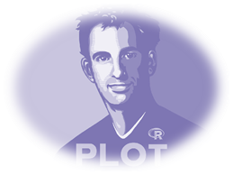
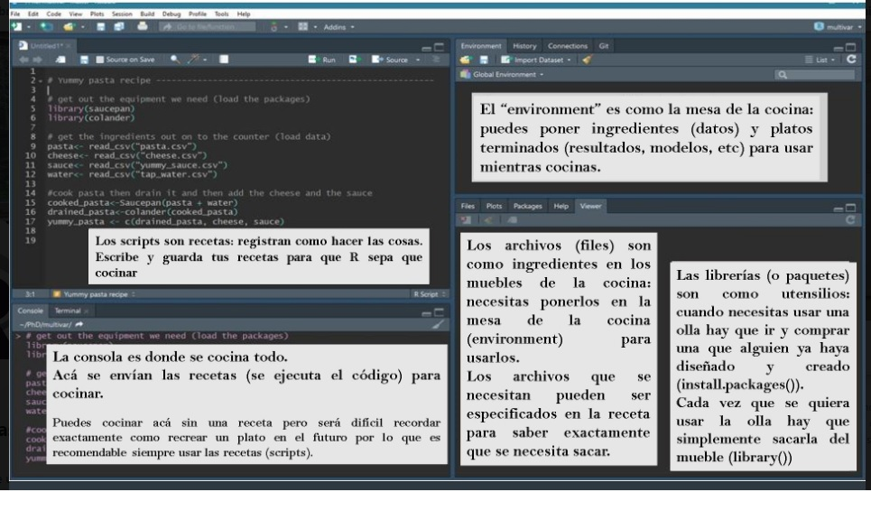
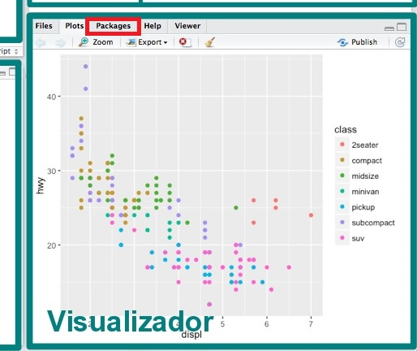
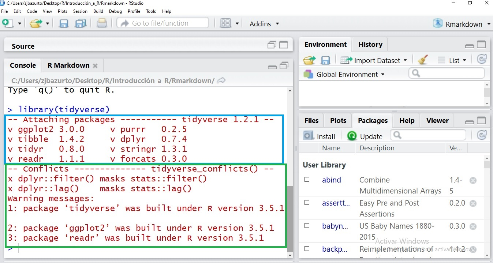
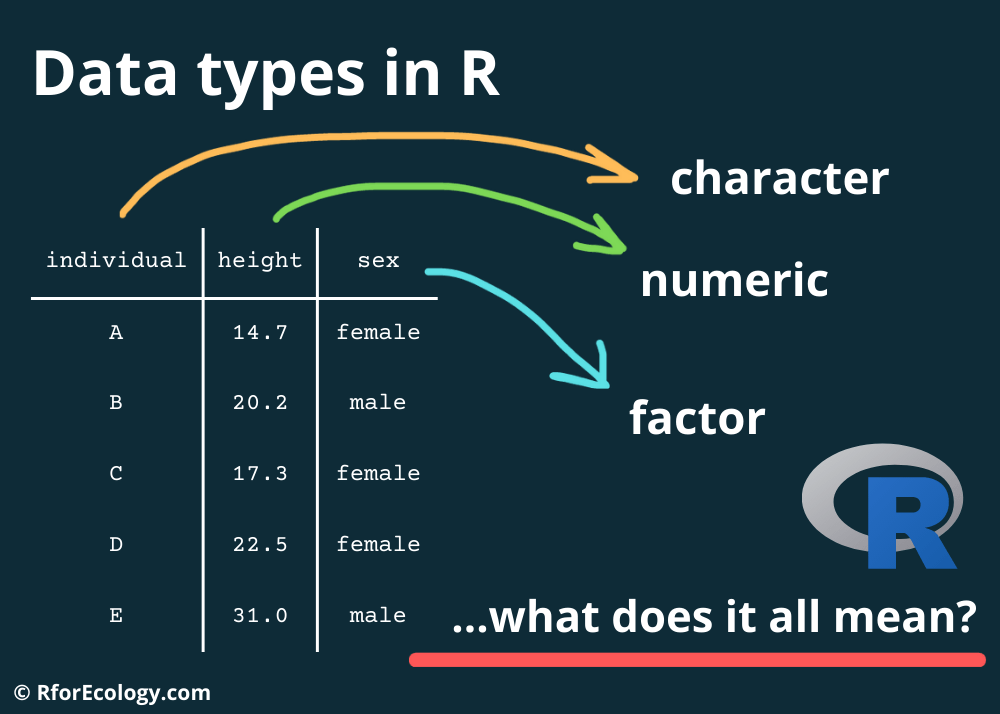
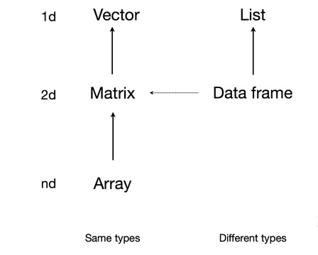
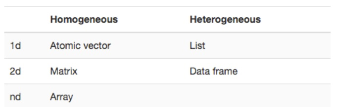

layout: true

```{r setup, include=FALSE}
library(flipbookr)
```

```{css, eval = TRUE, echo = FALSE}
.remark-code{line-height: 1.5; font-size: 90%}
@media print {
  .has-continuation {
    display: block;
  }
}
```

---


#.large[.fontone[.left[.opaco[Introducción a R y RStudio]]]]

### .center[.large[.fontone[.red[Esenciales de R]]]]


<br>
<br>


### .right[.opaco[.extralarge[<br>.fontone[Zulemma Bazurto Blacio  <br> New Dimensions | 2023]]]]


---
background-image: url("fig/Fondo - 2023.PNG")
background-size: cover
class: center, center, top


## .weight[.fontone[.nd[.left[Agenda]]]]
<br>

--

### .left[.fontone[.opaco[Introducción a herramientas]]]

<div class="left fontone opaco large">
<ul style="list-style-type: none">
<li>RStudio y sus ambientes</li> 
<li>Buenas prácticas en R</li>
<li>Tipos de datos</li>
<li>Estructuras de datos</li>
</ul>
</div>

--

### .left[.fontone[.opaco[Los primeros pasos en análisis de datos]]]

<div class="left fontone opaco large">
<ul style="list-style-type: none">
<li>El proceso de tidyverse</li> 
<li>Importando datos con R</li>
<li>Exploración y manipulación de datos</li>
</ul>
</div>


---
background-image: url("fig/Fondo - 2023.PNG")
background-size: cover
class: center, center, top


## .weight[.fontone[.nd[.left[¿Qué es R?]]]]

<div class="left fontone opaco large">
<p>

"Lenguaje de programación para entender los datos" Hadley Wickham, Chief Scientist, Rstudio
</p>
</div>


--

## .weight[.fontone[.nd[.left[¿Por qué R?]]]]

<div class="left fontone opaco large">

<ul style="list-style-type: disc">
<li>Software libre</li> 
<li>De código abierto</li>
<li>Flexible</li>
<li>Con contribución de la comunidad</li>
</ul>
</div>


---
background-image: url("fig/Fondo - 2023.PNG")
background-size: cover
class: center, center, top


## .weight[.fontone[.nd[.left[R-Ecosistema]]]]

--

<div class="left fontone opaco large">
<ul style="list-style-type: disc">
<li>Paquetes libres y pagados que extienden las capacidades de R</li> 
<br>
<li>Software de análisis basado en R</li>
<br>
<li>Interfaces gráficas de desarrollo (IDEs)</li>
<br>
<li>Interfaces gráficas de usuario (GUIs)</li>
<br>
<li>Integración de Bases de datos con R</li> 
<br>
<li>Integración de herramientas de BI con R</li> 
</ul>
</div>

---
background-image: url("fig/Fondo - 2023.PNG")
background-size: cover
class: center, center, top


## .weight[.fontone[.nd[.left[RStudio]]]]

--

<div class="left fontone opaco large">
<ul style="list-style-type: disc">
<li>Dato curioso: Antes era el nombre de la compañía que creaba/desarrollaba productos de software. ¡Hoy Posit!</li> 
<br>
--

--
<li>El producto más conocido es RStudioIDE (Integrated Developed Environment)</li>
</ul>
</div>

--


---
background-image: url("fig/Fondo - 2023.PNG")
background-size: cover
class: center, center, top


## .weight[.fontone[.nd[.left[¡Echando a andar RStudio!]]]]
### .left[.fontone[.opaco[En windows y Mac]]]

<div class="left fontone opaco large">
<ol>
<li>R (base): Comprehensive R Archive Network (CRAN) <br> https://cran.r-project.org/</li> 
<br>
<li>RStudio IDE: https://www.rstudio.com/products/rstudio/download/</li>
</ol>
</div>


---
## .center[.fontone[.nd[¿Podemos instalar primero RStudio IDE y luego R (base)?]]]

<div style="text-align: center">

</div>

---
background-image: url("fig/Fondo - 2023.PNG")
background-size: cover
class: center, center, top


## .weight[.fontone[.nd[.left[En Linux (Distribuciones)]]]]

<div class="left fontone opaco large">
<ul style="list-style-type: disc">
<li>Distribuciones basadas en Debian/Ubuntu tienen R en los repositorios oficiales</li> 
<br>
<li>Distribuciones basadas en Fedora/RedHat deben habilitar EPEL para tener R</li>
<br>
<li>En Debian Estable para tener nuevas versiones se debe utilizar un ["backports"]</li>
</ul>
</div>

#### .left[.fontone[.opaco[Pero antes necesitamos instalar: (https://cran.r-project.org/bin/linux/debian/)]]]


---
background-image: url("fig/Fondo - 2023.PNG")
background-size: cover
class: center, center, top


## .weight[.fontone[.nd[.left[Ventajas de R-Studio]]]]

--

<div class="left fontone opaco medium">
<ul style="list-style-type: disc">
<li>Todo en 1 ventana: Console, Workspace, History, Working directory, Files, Plot, Packages y Help</li> 
<br>
<li>Integración de la consola de R</li>
<br>
<li>Ejecutar código desde script</li>
<br>
<li>Resaltado de sintaxis</li>
<br>
<li>Completado de sintaxis</li>
<br>
<li>Manejo de proyectos con soporte para Git y Subversion</li>
<br>
<li>Herramientas para Investigación Reproducible (knitr)</li>
</ul>
</div>

---
background-image: url("fig/Fondo - 2023.PNG")
background-size: cover
class: center, center, top


### .left[.fontone[.opaco[Si abres RStudio debe lucir así:]]]
<br>
<br>


### .left[.fontone[.opaco[Éstos son los llamados 'Ambientes de RStudio']]]

---
background-image: url("fig/Fondo - 2023.PNG")
background-size: cover
class: center, center, top


## .weight[.fontone[.nd[.left[Ambientes de RStudio: una amigable analogía]]]]
<br>
<br>




---
background-image: url("fig/Fondo - 2023.PNG")
background-size: cover
class: center, center, top


## .weight[.fontone[.nd[.left[¿Qué es un paquete?]]]]

--

<div class="left fontone opaco">
<ul style="list-style-type: disc">

<li>Contienen datos, funciones y códigos.</li> 

--
<br>
<li>En analogía, son como aplicaciones para celulares.</li>
<br>

--
<li>Existen aproximadamente 19679 paquetes disponibles en CRAN que abordan una amplia gama de tópicos.</li>
</ul>
</div>

--

### .left[.fontone[.opaco[Instalemos algunos:]]]

<br>
<br>
<br>
<br>
<br>
<br>
<br>
<br>
<br>
<br>
<br>
<br>
<br>
<br>

```{r chunk-1, eval=FALSE, message=FALSE, warning=FALSE, echo=TRUE}
install.packages("tidyverse",repos = 'http://cran.us.r-project.org')
install.packages("dplyr",repos = 'http://cran.us.r-project.org')
install.packages("animation",repos = 'http://cran.us.r-project.org')
```

---
background-image: url("fig/Fondo - 2023.PNG")
background-size: cover
class: center, center, top


<br>
<br>
<br>
<br>
<br>
<br>
<br>
<br>

<div class="left fontone opaco">
<center><font size="15pt"> ¿Sabes qué acabas de hacer? 

--
<br> .nd[Escribir tus primeras líneas de código en R. ¡Buen trabajo!]</font>
</div>

---
background-image: url("fig/Fondo - 2023.PNG")
background-size: cover
class: center, center, top


## .weight[.fontone[.nd[.left[Pero, ¿puedes instalar paquetes de otra manera?]]]]

<br>
<br>

### .extra[.left[.fontone[.opaco[Vamos nuevamente al ambiente que denominamos "Visualizador"]]]]




---
background-image: url("fig/Fondo - 2023.PNG")
background-size: cover
class: center, center, top


## .weight[.fontone[.nd[.left[¿Cuál es la diferencia entre un error y un warning?]]]]

<br>
<br>
<br>
<br>
<br>
<br>

```{r chunk-2, eval=FALSE, message=FALSE, warning=FALSE, echo=TRUE}
install.packages(tidyverse)
```

#### .left[.red[.fontone[Error in install.packages : object 'tidyverse' not found]]]

<br>
<br>

```{r chunk-3, eval=FALSE, message=FALSE, echo=TRUE}
library(gapminder)
```

#### .left[.greenlime[.fontone[Warning message: package ‘gapminder’ was built under R version 4.1.3 ]]]

<br>
<br>
<br>
<br>

#### .left[.fontone[.opaco[¿Qué novedades presentan los códigos anteriores?]]]


---
background-image: url("fig/Fondo - 2023.PNG")
background-size: cover
class: center, center, top


### .left[.fontone[.opaco[Para trabajar eficientemente, necesitamos un ambiente de orden en R]]]

<br>
<br>
<br>
<br>

<div style="text-align: center">

</div>

### .left[.fontone[.opaco[Por eso .blues["CREAMOS PROYECTOS"] en R.]]]


---
background-image: url("fig/Fondo - 2023.PNG")
background-size: cover
class: center, center, top


## .weight[.fontone[.nd[.left[Proyectos en R-Studio]]]]

--

<div class="left fontone opaco large">
<ul style="list-style-type: disc">
<li>Un .blues[Proyecto] es una carpeta que contiene todos los scripts y archivos .RData y .Rhistory</li> 
<br>
<li>Al abrir un proyecto antiguo RStudio lo abre con las pestañas que se tenía activas</li>
<br>
<li>Permite colaboración utilizando GIT o Subversion</li>
<br>
<li>Se sugiere tener una estructura interior, por ejemplo: Scripts, Data, Exports, Info</li>
</ul>
</div>


---
background-image: url("fig/Fondo - 2023.PNG")
background-size: cover
class: center, center, top


## .weight[.fontone[.nd[.left[Iniciar un Proyecto en RStudio]]]]

<div class="left fontone opaco">
<ul style="list-style-type: none">
<li>File > New Project > New Directory > Empty Project > Poner nombre al Proyecto (se creará una carpeta con ese nombre) > Create Project </li>
</ul>
</div>


<div class="left fontone opaco">
<ul style="list-style-type: none">
<li>En la carpeta del proyecto crear las carpetas: Data, Exports, Scripts, Recursos (Recomendado) </li>
</ul>
</div>

---
background-image: url("fig/Fondo - 2023.PNG")
background-size: cover
class: center, center, top


## .weight[.fontone[.nd[.left[Creando un proyecto: Una mirada a las ventajas de realizarlo]]]]

--

<div class="left fontone opaco large">
<ul style="list-style-type: disc">
<li>Permite administrar de mejor manera nuestros códigos y datos.</li>
<br>
<li>Facilita la ubicación de archivos sin cambio de ruta en el computador.</li>
<br>
<li>Rstudio ejecuta sesiones independientes de R par cada proyecto.</li>
</ul>
</div>

---
background-image: url("fig/Fondo - 2023.PNG")
background-size: cover
class: center, center, top


<br>
<br>

<div class="left fontone opaco large">
Tenemos todo listo para ¡poner manos a la obra!
</div>

<br>
<br>

<div class="left fontone opaco">
<center><font size="15pt"> Empecemos cargando paquetes 
<br> 

--
.nd[¿Y ÉSTO DE QUÉ VA AHORA?]</font>
</div>

--
<br>
<br>
<br>
<br>
<br>
<br>

<div class="center">

</div>

---
background-image: url("fig/Fondo - 2023.PNG")
background-size: cover
class: center, center, top


## .weight[.fontone[.nd[.left[Cargando un paquete]]]]

<br>
<br>

<div class="left fontone opaco">
Cargar un paquete significa .blues[activarlo]
</div>

<br>

<div class="left fontone opaco">
Para cargar paquetes usamos la función .blues[library()]
</div>

<br>

```{r chunk-4, message=FALSE, warning=FALSE}
library(tidyverse)
library(gapminder)
library(babynames)
```

<br>

--

<div class="left fontone opaco">
Sabemos la función para cargar paquetes pero .nd[no hemos ejecutado el código]. Las opciones para lo anterior son:
</div>

<div class="left fontone opaco">
<ul style="list-style-type: disc">
<li>EL botón .blues[Run]</li>
<li>Ctrl + Enter (En Linux/Windows)</li>
</ul>
</div>

<div class="left fontone opaco">
<center><font size="15pt">¡A ejecutar código!</font>
</div>

---
background-image: url("fig/Fondo - 2023.PNG")
background-size: cover
class: center, center, top


## .weight[.fontone[.nd[.left[Cargando un paquete]]]]

<br>
<br>

<div class="left fontone opaco">
Al ejecutar library() los posibles mensajes (avisos) que se pueden obtener son:
</div>

<div class="left fontone opaco">
<ul style="list-style-type: disc">
<li>Cómo el paquete se ha cargado</li>
<li>Conflicto: es un aviso de que las funciones de un paquete tienen el mismo nombre que funciones de otro paquete.</li>
</ul>
</div>

<div class="center">

</div>

---
background-image: url("fig/Fondo - 2023.PNG")
background-size: cover
class: center, center, top


## .weight[.fontone[.nd[.left[Buenas prácticas: Haciendo eficiente tu código]]]]

<br>
<br>
<br>
<br>
<br>

<div class="left fontone opaco medium">
<ul style="list-style-type: disc">
<li>LLamar todos los paquetes que ocuparemos al inicio de nuestro script.</li>

--
.red[¿Y si no sé qué paquetes usar?]
<br>
--
<br>
<li>Comentar mi script.</li>

--
.red[¿Cómo lo hago?]
<br>

--

<br>
<li>Al inicio comentar el objetivo y/o contexto del script.</li>
</ul>
</div>

<br>
<br>

<div class="left fontone opaco medium">
A medida que vayas avanzando, combinarás los primeros pasos aprendidos con nuevos aprendizajes.
</div>

---
background-image: url("fig/Fondo - 2023.PNG")
background-size: cover
class: center, center, top


## .weight[.fontone[.nd[.left[Generalidades 1]]]]

--

<br>
<br>

<div class="left fontone opaco">
<ul style="list-style-type: disc">
<li>Case sensitivity (.blues[Abc] es diferente de .blues[abc])</li>
<br>
<li>R, aparte de objetos, tiene:</li>
</ul>
</div>

<br>
<br>
<br>
<div class="left fontone opaco">
.weight[Expresión.-] Se evalúa, se imprime y el valor se pierde
</div>

<br>
<br>
<br>


```{r chunk-5, fig.align='center'}
5+5 # Expresión
```


<div class="left fontone opaco">
.weight[Asignación.-] Evalúa la expresión y guarda el resultado en una variable (no lo imprime)
</div>

```{r asigna}
a <- 5
a <- 2*a # Reasigna el valor a la variable "a"

```


---
background-image: url("fig/Fondo - 2023.PNG")
background-size: cover
class: center, center, top


## .weight[.fontone[.nd[.left[R como calculadora]]]]

<br>
<br>
<br>

--

```{r chunk-7, echo=TRUE}
2 + 3*5
log((1+2+3)/4) # log natural 
pi^2 # pi y potencia
```

---
background-image: url("fig/Fondo - 2023.PNG")
background-size: cover
class: center, center, top


## .weight[.fontone[.nd[.left[R como calculadora]]]]

<br>
<br>
<br>

--

```{r chunk-8, echo=TRUE}
abs(-2) # valor abosluto 
factorial(3) # factorial
floor(5.7) # funcion piso
```

---
background-image: url("fig/Fondo - 2023.PNG")
background-size: cover
class: center, center, top


## .weight[.fontone[.nd[.left[Generar secuencias, repeticiones y aleatorios]]]]

<br>
<br>
<br>

--

```{r chunk-9, echo=TRUE}
1:10 # secuencia de 1 a 10, de 1 en 1
seq(from= 0, to= 20, by= 5) # función seq
seq(from= 5, by= 5, length.out= 5) # función seq
```

---
background-image: url("fig/Fondo - 2023.PNG")
background-size: cover
class: center, center, top


## .weight[.fontone[.nd[.left[Generar secuencias, repeticiones y aleatorios]]]]

<br>
<br>
<br>

--

```{r chunk-10, echo=TRUE}
rep(x= 3, times= 5) # repetir 5 veces el # 3
runif(n= 10, min= 1, max= 5) # Genera aleatorios uniformes
rnorm(n= 10, mean= 100, sd= 10) # Genera aleatorios normales
```

---
background-image: url("fig/Fondo - 2023.PNG")
background-size: cover
class: center, center, top


## .weight[.fontone[.nd[.left[Asignaciones]]]]

<br>
<br>

<div class="left fontone opaco medium">
Asigna el valor '5' a la variable 'a':
</div>

--

<div class="left fontone opaco medium">
<ul style="list-style-type: disc">
<li>a <- 5</li>
<li>5 -> a</li>
<li>assign("a", 5)</li>
</ul>
</div>

--

<div class="left fontone opaco medium">
Asigna globalmente el valor '5' a la variable 'a', (dentro de una función 'a' seguirá valiendo 5):
</div>

--

<div class="left fontone opaco medium">
<ul style="list-style-type: disc">
<li>a <<- 5</li>
<li>5 ->> a</li>
</ul>
</div>

--

<div class="left fontone opaco medium weight">
No se recomienda usar 'a = 5'. En RStudio verificar que exista la variable 'a' en la pestaña Environment.
</div>  

---
background-image: url("fig/Fondo - 2023.PNG")
background-size: cover
class: center, center, top


## .weight[.fontone[.nd[.left[Asignaciones]]]]

<br>
<br>

<div class="left fontone opaco medium">
El resultado de una función de un objeto X puede ser asignada al mismo objeto X en la misma sentencia, es decir 
</div>

<br>
<br>

```{r chunk-11}
a <- 5 # Expresión
a
a <- 2*a
a
```

---
background-image: url("fig/Fondo - 2023.PNG")
background-size: cover
class: center, center, top


## .weight[.fontone[.nd[.left[Tipos de datos]]]]

<br>
<br>

<div class="left fontone opaco medium">
Existen los siguientes tipos de datos
</div>

--

<div class="left fontone opaco medium">
<ul style="list-style-type: disc">
<li>Numérico (num)</li>

<br>
<li>Caracter (chr)</li>

<br>
<li>Factor</li>

<br>
<li>Lógico</li>

<br>
<li>Fecha (date)</li>
</ul>
</div>

--

<div style="top: -150px; right: 200px; float:right;position: relative">

</div>

---
background-image: url("fig/Fondo - 2023.PNG")
background-size: cover
class: center, center, top


## .weight[.fontone[.nd[.left[Estructura de datos]]]]

<br>
<br>

--

<div class="left fontone opaco">
Existen 5 estructuras de datos básicos:
</div>

<div class="left fontone opaco medium">
<ul style="list-style-type: disc">
<li>Vector</li>
<li>Matriz</li>
<li>Array</li>
<li>Data Frame</li>
<li>Lista</li>
</ul>
</div>

--

<div style="top: -150px; right: 200px; float:right;position: relative">

</div>

---
background-image: url("fig/Fondo - 2023.PNG")
background-size: cover
class: center, center, top


<br>
<br>

<div class="left fontone opaco medium">
El uso de las estructuras de datos se diferencian por la clase de sus elementos:
</div>

<br>
<br>




---
background-image: url("fig/Fondo - 2023.PNG")
background-size: cover
class: center, center, top


## .weight[.fontone[.nd[.left[Tipos de vectores]]]]

<br>
<br>

--

<div class="left fontone opaco">
Numéricos
</div>

<br>

```{r chunk-12}
num_vec <- c(-1, 2.5, 3, 4, 5.1)
```

--

<div class="left fontone opaco">
Caracter
</div>

<br>

```{r chunk-13}
cha_vec <- c("Mon", "Tue", "Wed", "Thu", "Sat", "Sun")
```

--

<div class="left fontone opaco">
Lógico
</div>

<br>

```{r chunk-14}
boo_vec <- c(TRUE, FALSE, FALSE, TRUE, TRUE, FALSE)
```

--

## .weight[.fontone[.opaco[.left[¿Qué es c()?]]]]

---
background-image: url("fig/Fondo - 2023.PNG")
background-size: cover
class: center, center, top


## .weight[.fontone[.nd[.left[Factores]]]]

<br>
<br>

<div class="left fontone opaco">
Un factor en R es un tipo de vector con un enfoque estadístico que se usa para variables categóricas. Recuerda que las variables categóricas pueden ser medidas por 2 tipos de escala:
</div>

<div class="left fontone opaco">
<ul style="list-style-type: disc">
<li>Nominal</li>
<li>Ordinal</li>
</ul>
</div>

<div class="left fontone opaco">
En R un factor se define con la función .blues[factor()]
</div>

<br>
<br>
<br>
<br>
<br>
<br>
<br>
<br>
<br>
<br>

--

```{r chunk-15}
#Variable categórica nominal
sex_vec <- c("F", "M", "M", "F", "M")
```

## .fontone[.opaco[.left[¿Qué sucede con los niveles de la variable en esta escala?]]]


---
background-image: url("fig/Fondo - 2023.PNG")
background-size: cover
class: center, center, top


<br>
<br>
<br>
<br>
<br>
<br>

<div class="left fontone opaco">
<center><font size="15pt"> Vamos por las categóricas ordinales! 
<br> 

--
.nd[NOTA: Toma en cuenta qué pasa con los niveles por la naturaleza de la escala de medición]</font>
</div>


---
background-image: url("fig/Fondo - 2023.PNG")
background-size: cover
class: center, center, top


.left[.fontone[Si construimos el factor "temp_vec":]]

```{r}
temp_vec <- c("High", "Low", "Medium", "Low", "Low", "Medium", "High", "Low","Medium", "Low", "Low")
```

--
```{r}
temp_fct <- factor(temp_vec, 
                   levels = c("Low", "Medium", "High"), 
                   ordered = T)
```

.left[.fontone[De manera que luciría]]

```{r}
temp_fct
```

---


```{r chunk-17}
temp_vec <- c("High", "Low", "Medium", "Low", 
              "Low", "Medium", "High", "Low", 
              "Medium", "Low", "Low")
temp_fct <- factor(temp_vec, 
                   levels = c("Low", "Medium", "High"), 
                   ordered = T)
temp_fct
```

---
background-image: url("fig/Fondo - 2023.PNG")
background-size: cover
class: center, center, top


<br>

#### .medium[.left[.opaco[.fontone[Modifiquemos los nombres de las etiquetas. Es muy útil cuando aquellos nombres son muy extensos.]]]]

<br>
<br>

```{r chunk-18, message=FALSE, warning=FALSE}
levels(temp_fct) <- c("L", "M", "H")
temp_fct
```

<div class="left fontone opaco">
.red[¿Y si necesito resumir la información del vector?] <br>

--
Tenemos otra función: .blues[summary()]
</div>


---
background-image: url("fig/Fondo - 2023.PNG")
background-size: cover
class: center, center, top


<br>

<div class="left fontone opaco medium">
Funciones útiles asociadas a este tipo de dato son: pueden ser medidas por 2 tipos de escala:
</div>

<div class="left fontone opaco medium">
<ul style="list-style-type: disc">
<li>Combinar o concatenar: .blues[c()]</li>
<li>Clase: .blues[class()]</li>
<li>Longitud de: .blues[length()]</li>
<li>Imprimir: .blues[print()]</li>
</ul>
</div>

<br>

<div class="left fontone opaco medium">
¡ A probarlas! 
<br>
<br>
.weight[NOTA:] Una forma de aprender la lógica de R, es probar lo que crees que debería ser como resultado contrastado con tu razonamiento en funciones de R.
</div>


---
background-image: url("fig/Fondo - 2023.PNG")
background-size: cover
class: center, center, top


## .weight[.fontone[.nd[.left[Un breve vistazo a matrices]]]]

<br>
<br>

<div class="left fontone opaco">
Una matriz es un arreglo de dos dimensiones en el que todos los elementos son del mismo tipo, por ejemplo: numéricos 
<br>
<br>
Sintaxis de la función .blues[matrix()]:
<br>
<br>
.blues[matrix(data,nrow,ncol,byrow)]
<br>
<br>
.blues[matrix()] crea una matriz de un vector especificando dimensiones.
</div>

<br>
<br>
<br>
<br>
<br>
<br>
<br>
<br>

--

```{r chunk-19}
matrix(data = 1:9, nrow = 3, ncol = 3, byrow = F)
```

---
background-image: url("fig/Fondo - 2023.PNG")
background-size: cover
class: center, center, top


## .weight[.fontone[.nd[.left[Ejemplo]]]]

<br>
<br>

<div class="left fontone opaco">
En el siguiente vector se presentan los ingresos totales y de lanzamiento de cada película de la saga Harry Potter
</div>

<br>
<br>

--

```{r chunk-20}
sales_hp <- c(497066400, 426630300, 401608200, 399302200, 377314200, 
              359788300, 357233500, 328833900, 141823200, 189432500, 
              142414700, 135197600, 99635700, 92756000, 134119300, 
              138752100)
```


<div class="left fontone opaco">
.weight[El reto:] Toma el vector .nd[sales_hp] y crea una matriz con 8 filas llenándola por columnas. .weight[¿Necesito especificar las columnas?]
</div>


---
background-image: url("fig/Fondo - 2023.PNG")
background-size: cover
class: center, center, top


## .weight[.fontone[.nd[.left[Funciones más útiles para las matrices]]]]

<div class="left fontone opaco">
<ul style="list-style-type: disc">
<li>.blues[dim()]: entrega la dimensión de la matriz</li>
<br>
<li>.blues[nrow()]: entrega el número de filas de la matriz</li>
<br>
<li>.blues[ncol()]: entrega el número de columnas de la matriz</li>
<br>
<li>.blues[ [ , ] ]: selecciona los elementos de una matriz considerando las dimensiones de la misma.</li>
<br>
<li>.blues[rownames()]: agrega nombres a las filas de la matriz</li>
<br>
<li>.blues[colnames()]: agrega nombres a las columnas de la matriz</li>
</ul>
</div>

<br>
<br>
<br>
<br>
<br>
<br>
<br>
<br>
<br>
<br>
<br>
<br>
<br>
<br>
<br>
<br>

--

```{r chunk-21, eval = FALSE}
sales_hp <- matrix(sales_hp, nrow = 8)

dim(sales_hp)
nrow(sales_hp)
ncol(sales_hp)
```

---
background-image: url("fig/Fondo - 2023.PNG")
background-size: cover
class: center, center, top


## .weight[.fontone[.nd[.left[El más usado: Dataframe]]]]

<br>
<br>

<div class="left fontone opaco medium">
Un dataframe es un objeto de dos dimensiones en R. Puede verse como un arreglo de vectores de la misma dimensión, similar a una matriz.
<br>
<br>
.nd[¿Cuál es la diferencia con una matriz?]
<br>
La función .blues[dataframe()] permite:
</div>

--

<div class="left fontone opaco medium">
<ul style="list-style-type: disc">
<li>Crear un nuevo dataframe</li>
<li>Transformar una matriz a dataframe</li>
</ul>
</div>


---
background-image: url("fig/Fondo - 2023.PNG")
background-size: cover
class: center, center, top


## .weight[.fontone[.nd[.left[El más usado: Dataframe]]]]

<br>
<br>

```{r chunk-22}
#Creando un dataframe
muestra_df <- data.frame(secuencia = 1:5,
                         aleatorio = rnorm(5),
                         letras = c("a", "b", "c", "d", "e"))
muestra_df
```

---
background-image: url("fig/Fondo - 2023.PNG")
background-size: cover
class: center, center, top


## .weight[.fontone[.nd[.left[Transformando una matriz en Dataframe]]]]

<br>
<br>

```{r chunk-23, message=FALSE, warning=FALSE}
#Transformando una matriz a dataframe
sales_df <- data.frame(sales_hp)
head(sales_df) # head() retorna por default las primeras 6 filas
```


<div class="left fontone opaco">
Otras funciones para usar en dataframe:
</div>

<div class="left fontone opaco">
<ul style="list-style-type: disc">
<li>.blues[rownames()] y .blues[colnames()]</li>
<li>.blues[$]</li>
<li>.blues[str]</li>
<li>.blues[dim()]</li>
<li>.blues[nrow()], .blues[ncol()]</li>
</ul>
</div>


---
background-image: url("fig/Fondo - 2023.PNG")
background-size: cover
class: center, center, top


## .weight[.fontone[.nd[.left[¡Son titanes!: Listas]]]]

<br>
<br>
<br>

<div class="left fontone opaco medium">
Una lista en R es un objeto que permite una estructura de datos complicada, una super estructura. .weight[Esto porque permite reunir diferentes tipos de objetos:]
</div>

--

<div class="left fontone opaco medium">
<ul style="list-style-type: disc">
<li>Vectores</li>
<li>Matrices</li>
<li>Dataframes</li>
<li>Listas</li>
</ul>
</div>

--

<div class="left fontone opaco medium">
Muchas funciones que usarás en el futuro, sobre todo de modelación, regresan resultados de estructuras complicadas y lo almacenan en listas. Por ejemplo, la función .blues[lm()]
</div>

---
background-image: url("fig/Fondo - 2023.PNG")
background-size: cover
class: center, center, top


<br>
<br>
<br>
<br>
<br>
<br>
<br>
<br>
<br>

<div class="left fontone opaco">
<center><font size="20pt"> SEMANA 1: DONE! 
<br> 

