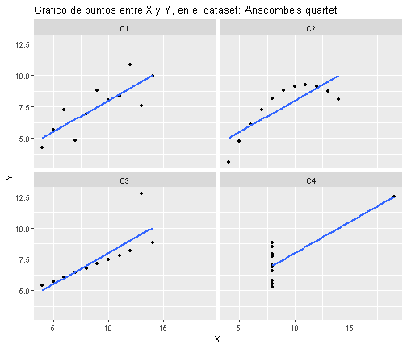

background-image: url("Imagenes/Fondo - 2023.PNG")
background-size: cover
class: left, left, top


# Importancia del EDA

Partamos del conocido set de datos Anscombe's quartet  
Poniendo el set en un formato correcto


```
##     X     Y CASO
## 1  10  8.04   C1
## 2   8  6.95   C1
## 3  13  7.58   C1
## 4   9  8.81   C1
## 5  11  8.33   C1
## 6  14  9.96   C1
## 7   6  7.24   C1
## 8   4  4.26   C1
## 9  12 10.84   C1
## 10  7  4.82   C1
## 11  5  5.68   C1
## 12 10  9.14   C2
## 13  8  8.14   C2
## 14 13  8.74   C2
## 15  9  8.77   C2
```


---
background-image: url("Imagenes/Fondo - 2023.PNG")
background-size: cover
class: left, left, top


# Importancia del EDA

Partamos del conocido set de datos Anscombe's quartet  

Obteniendo la correlación de los 4 casos sería:


```
## # A tibble: 4 x 2
##   CASO  CORRELACION

## 1 C1          0.816
## 2 C2          0.816
## 3 C3          0.816
## 4 C4          0.817
```
--

Parece una correlación fuerte, sin embargo al graficar los datos...


---
background-image: url("Imagenes/Fondo - 2023.PNG")
background-size: cover
class: left, left, top


# Importancia del EDA

En el set de datos Anscombe's quartet tenemos correlaciones de 0.81, sin embargo al graficar:


```{r echo=FALSE}

```


---
background-image: url("Imagenes/Fondo - 2023.PNG")
background-size: cover
class: left, left, top


# Gramar of Graphics - ggplot2


"Good grammar is just the first step in creating a good sentence" Wickham  


--
La gramática de los gráficos permite disgregarlos en varias componentes, en breve podemos decir que un gráfico toma los datos y asigna una o más variables a los atributos estéticos (componentes, color, forma, tamaño) de los objetos geométricos (puntos, líneas, barras) que se ha elegido para representarlos. Todo esto contenido en un layer que puede combinado con otros para obtener gráficos más avanzados.  

--

Un gráfico también puede incluir transformaciones estadísticas de los datos y se le asocia un sistema de coordenadas de la gráfica. Finalmente, se puede tener "facetas" que se pueden usar para generar el gráfico para diferentes subconjuntos de datos.  


---
background-image: url(Imagenes/ggplot-grammar-of-graphics-stack-1_rectangular.png)
background-size: cover
class: left, left, top

---
background-image: url("Imagenes/Fondo - 2023.PNG")
background-size: cover
class: left, left, top


# Generando gráficos con ggplot2!

Puedes usar este código genérico para hacer miles de gráficos con **ggplot2**.

```{r eval = FALSE}
ggplot(data = <DATA>) +
  <GEOM_FUNCTION>(mapping = aes(<MAPPINGS>))
```

---
#Variables cuantitativas

```{r include=FALSE}
library(openxlsx)
library(magrittr)
library(tidyverse)
library(dplyr)

data_banco<-read.xlsx("Data/Data_Banco.xlsx",sheet = "Data")

data_banco_3<-data_banco %>% mutate(Monto=str_replace(Monto,pattern=",",replacement=".")) %>%
  mutate(Sucursal=as.character(Sucursal),
         Cajero=as.character(Cajero),
         Satisfaccion=parse_factor(Satisfaccion,levels=c("Muy Malo","Malo","Regular","Bueno","Muy Bueno"),ordered=T),
         Monto=parse_number(Monto,locale=locale(decimal_mark = ".")))

```


```{r fig.height=8, fig.width=25}
ggplot(data_banco_3,aes(x= Tiempo_Servicio_seg)) +
  geom_histogram() +
  labs(title = "Distribución del Tiempo de Servicio en segundos", y = "Cantidad", x = "Tiempo (Segs)") +
  facet_wrap(~Sucursal)
```

---
# El famoso boxplot: diagrama de cajas
```{r fig.height=7, fig.width=25}
ggplot(data_banco_3,aes(x= "",y= Monto)) +
  geom_jitter(alpha = 0.05, color = "gray") +
  geom_boxplot(fill = "steelblue",alpha = 0.1) +
  coord_flip() +
  labs(title = "Boxplot de Monto", y = "Dólares") +
  theme_light()
```

---
# Variables cualitativas: infaltables!

```{r fig.height=6, fig.width=25}
ggplot(data_banco_3,aes(x=forcats::fct_infreq(Sucursal)))+
  geom_bar(aes(fill= Sucursal)) +
  geom_text(aes(label = stat(count)),stat="count", nudge_y = 500)+
  labs(title="Cantidad de transacciones por Sucursal", y ="Cantidad", x ="Sucursal")+
  theme_bw()+
  theme(legend.position = "none")
```

---
# Ggplot es infinito: te animo a seguir explorando!

<br>
<br>


<div style="text-align: center">

</div>


---
class: inverse, center, middle, hide_logo

# FIN

## Curso: Módulo R - Becas New Dimensions
### Zulemma Bazurto Blacio | LIDE
