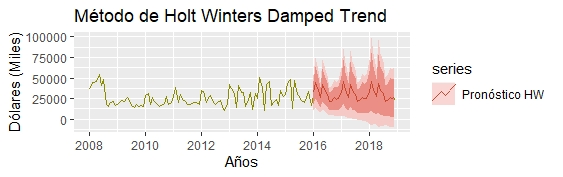
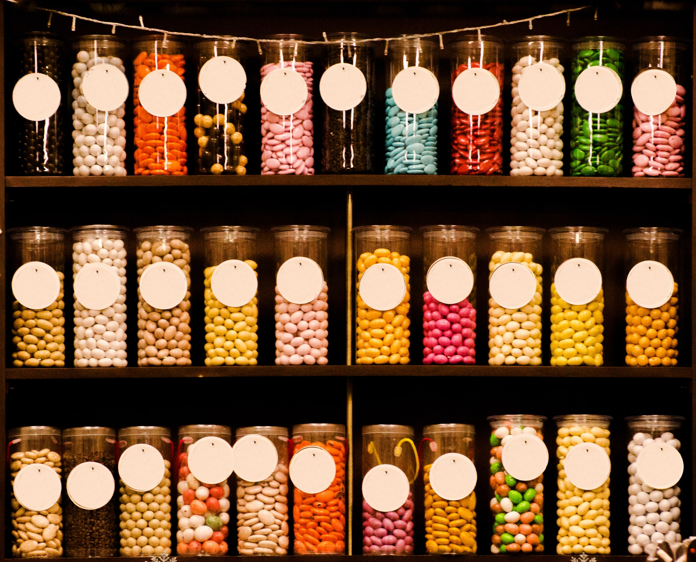
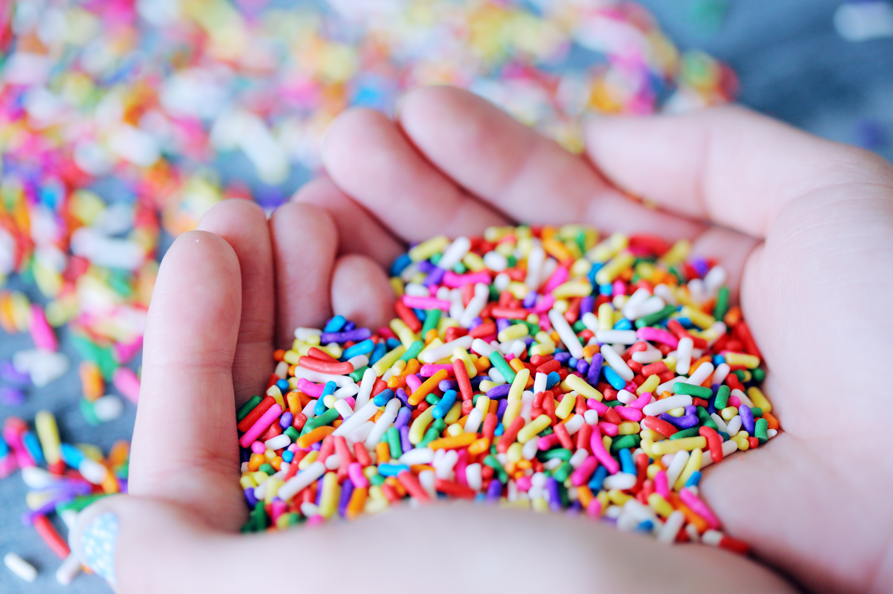
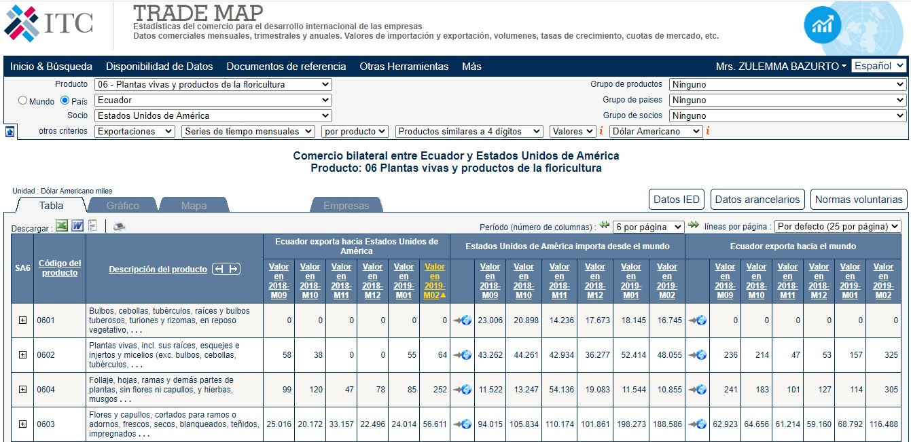
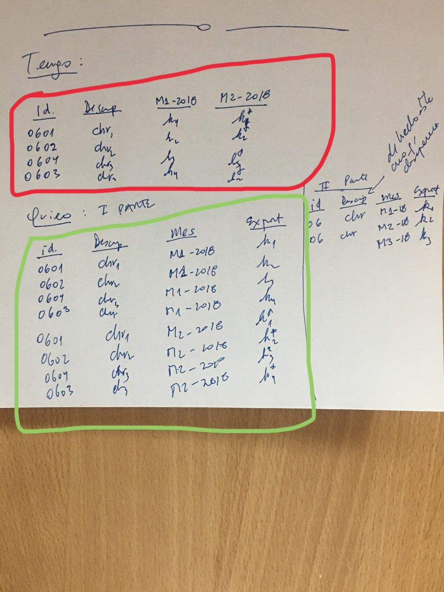
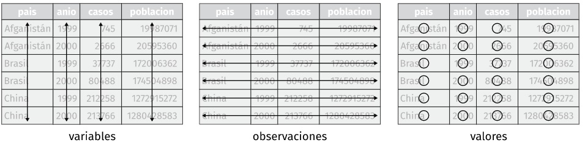
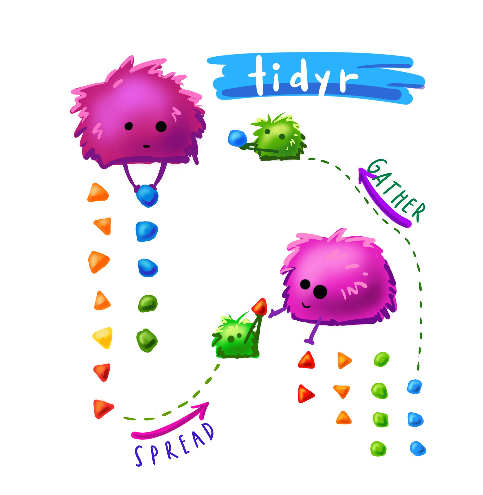
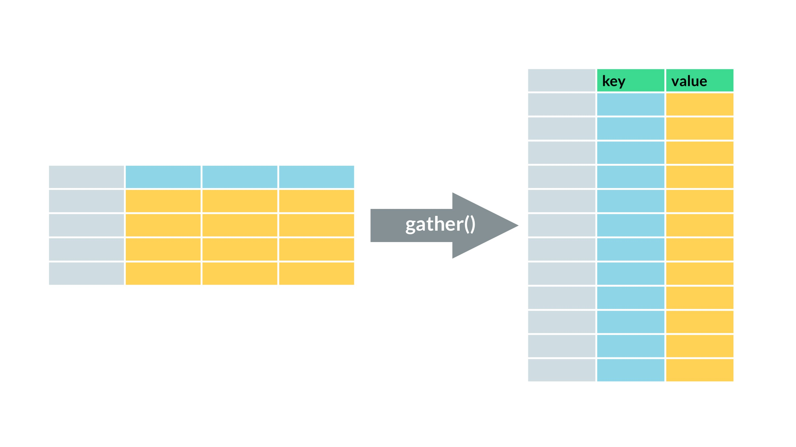

layout: true


---
background-image: url(fig/rhispano.jpg)
background-size: cover
class: center, center, top

#.larger[.fontone[.white[tidyr: el superhéroe de tidy data]]]


.white[<br><br><br><br><br><br><br><br><br><br><br><br><br><br>.large[.fontone[Zulemma Bazurto Blacio ]]]


---
background-image: url("fig/Fondo - 2023.PNG")
background-size: cover
class: center, center, top


## .textcenter[.rladies[.fontone[Motivación: Método de Pronóstico para Exportaciones de Flores de Ecuador a USA]]]




.fontone[.textcenter[.weight[¿DEBEN LOS EXPORTADORES DE FLORES CONTINUAR INVIRTIENDO EN EL MERCADO ESTADOUNIDENSE?]]]
---
background-image: url("fig/Fondo - 2023.PNG")
background-size: cover
class: center, center, top


## .textcenter[.rladies[.fontone[El génesis del procesamiento de datos:<br> las fuentes de información]]]


<div class=" fontone weight  large">
<ul style="list-style-type: none">
        <li> ¿QUÉ USAR?: Datos históricos acerca de las Exportaciones de Flores (del Banco Central del Ecuador)</li> 
        <br>
        <li> SE USÓ: Datos históricos mensuales obtenidos de TradeMap.</li>
        </ul>
</div>

🚧🚧🚧🚧🚧🚧🚧🚧🚧🚧🚧🚧🚧🚧🚧🚧🚧🚧🚧🚧🚧🚧🚧
<br>
<br>

<div class=" rladies fontone weight  exlarge">
<ul style="list-style-type: none">

<li>😒😒😒AQUÍ EMPEZÓ EL PROBLEMA😒😒😒</li> 
---
background-image: url("fig/Fondo - 2023.PNG")
background-size: cover
class: center, center, top


## .textcenter[.rladies[.fontone[EXPECTATIVA]]]


---
background-image: url("fig/Fondo - 2023.PNG")
background-size: cover
class: center, center, top


## .textcenter[.rladies[.fontone[REALIDAD]]]


---
background-image: url("fig/Fondo - 2023.PNG")
background-size: cover
class: center, center, top


## .textcenter[.rladies[.fontone[LOS DATOS EN LA REALIDAD: <br> DULCES QUE SON SINSABORES]]]

<div class="row">
<div class="textcenter textmiddle fontone black large">
<ul style="list-style-type: none">
        <li>😫 Datos no disponibles por las Instituciones del Estado que manejan cifras de Exportaciones.</li> 
        <br>
        <li>😫 Data recabada en fuentes externas: formato no deseable.</li>
        <br>
        <li>😫 Periodicidad deseada, data particionada</li>
        <br>
        </ul>
</div>
---
background-image: url("fig/Fondo - 2023.PNG")
background-size: cover
class: center, center, top


## .textcenter[.rladies[.fontone[LOS DATOS EN LA REALIDAD: <br> DULCES QUE SON SINSABORES]]]



---
background-image: url("fig/Fondo - 2023.PNG")
background-size: cover
class: center, center, top


## .textcenter[.rladies[.fontone[NUESTROS PROBLEMAS CON LA DATA]]]

<div class="row">
<div class="textcenter textmiddle fontone black large">
<ul style="list-style-type: none">
        <li>🤹️Sólo se podían descargar las exportaciones mensuales en archivos por separado.</li> 
        <br>
        <li>🤹 En Trademap, las bases descargadas fueron por partida arancelaria.</li>
        <br>
        <li>🤹 Wide format presente🤡🤡</li>
        <br>
        <li>🤹 Títulos de columnas con caracteres especiales.</li>
        <br>
        <li>🤹 La columna código no sería un ID en sí mismo al importar la data.</li>
        </ul>
</div>
---
background-image: url("fig/Fondo - 2023.PNG")
background-size: cover
class: center, center, top


## .textcenter[.rladies[.fontone[LO QUE TENGO VS LO QUE QUIERO]]]



---
background-image: url(fig/r4ds.png)
background-size: cover
class: center, center, top


---
background-image: url("fig/Fondo - 2023.PNG")
background-size: cover
class: center, center, top


## .fontone[.rladies[El proceso Tidyverse: Los primeros pasos en análisis de datos]]

</div>

---
background-image: url(fig/fore.jpg)
background-size: cover
class: center, center, top


---
background-image: url("fig/Fondo - 2023.PNG")
background-size: cover
class: center, center, top


## .fontone[.rladies[Los dulces en orden: tidy data]]


<div class= 'center'></div>

<div class="aligncenter fontone black large">
<ul style="list-style-type: none">
        <li>🍬 Cada variable debe tener su propia columna.</li> 
        <br>
        <li>🍬 Cada observación debe tener su propia fila.</li>
        <br>
        <li>🍬 Cada valor debe tener su propia celda.</li>
        <br>
        </ul>
</div>
---
background-image: url("fig/Fondo - 2023.PNG")
background-size: cover
class: center, center, top


## .large[.fontone[.rladies[Breaking News:<br> Non-tidy data!]]]


<div class="textcenter textmiddle fontone black large">
<ul style="list-style-type: none">
        <li>🎭 8 archivos .xlsx: Unir data.</li> 
        <br>
        <li>🎭 Wide format -> Long format.</li>
        <br>
        <li>🎭 Necesitamos separar columnas.</li>
        <br>
        <li>🎭 ¡Unir columnas también!</li>
        </ul>
</div>
---
background-image: url("fig/Fondo - 2023.PNG")
background-size: cover
class: center, center, top


</div>
---
background-image: url("fig/Fondo - 2023.PNG")
background-size: cover
class: center, center, top


## .fontone[.rladies[Manipulación de datos: <br>tidyr y sus bloques para ordenar]]


<div class="col-1x fontone weight  large">
<ul style="list-style-type: none">
I. RESHAPE DATA
<br>
<br>
        <li> gather()</li> 
        <br>
        <li> spread()</li>
        <br>
        <li> pivot_longer()</li> 
        <br>
        <li> pivot_wider() </li> 
</ul>       


<div class="col-1x fontone weight  .extralarge">
<ul style="list-style-type: none">

II. SPLIT CELLS
<br>
<br>
        <li> unite() </li> 
        <br>
        <li> separate()</li>
</ul>       
<br>
<br>
<br>
<br>
<div class="col-1x fontone weight  .extralarge">
<ul style="list-style-type: none">
III. EXPAND TABLES
<br>
<br>
        <li> complete() </li> 
        <br>
        <li> expand()</li>
</ul> 

<div class="col-1x fontone rladies weight  .extralarge">
<ul style="list-style-type: none">
<br>
Otro tipo de manipulación: manipulación de casos y variables con **dplyr**
</div>
---
background-image: url(https://i.pinimg.com/originals/f9/f7/84/f9f784ce072f7fcf18211af0bad5d437.gif)
background-size: cover
class: center, center, top


## .fontone[.rladies[.large[Rewind al Proceso Tidyverse]]]
---
background-image: url(https://media1.tenor.com/images/3d966a654be29ed3d5ad2013516183ca/tenor.gif?itemid=11315269)
background-size: 800px 800px
class: center, center, top


## .texcenter[.white[.fontone[Camino a Importar la data]]]
---
background-image: url("fig/Fondo - 2023.PNG")
background-size: cover
class: center, center, top


.exlarge[.fontone[.rladies[Cargando paquetería para este caso]]]
```{r message=FALSE, warning=FALSE}
library(tidyverse)
library(openxlsx)
library(tidyr)
library(ggplot2)
library(ggfortify)
library(forecast)
library(patchwork)
library(dplyr)
```

# .fontone[.rladies[Importando las 8 bases de datos]]

.fontone[.rladies[.larger[FoRma 1: Importar uno a uno los archivos .xlsx con read.xlsx() del paquete openxlsx]]]

```{r}
base_1<-read.xlsx("data/base_1.xlsx",detectDates = TRUE)
base_2<-read.xlsx("data/base_2.xlsx",detectDates = TRUE)
base_3<-read.xlsx("data/base_3.xlsx",detectDates = TRUE)
base_4<-read.xlsx("data/base_4.xlsx",detectDates = TRUE)
base_5<-read.xlsx("data/base_5.xlsx",detectDates = TRUE)
base_6<-read.xlsx("data/base_6.xlsx",detectDates = TRUE)
base_7<-read.xlsx("data/base_7.xlsx",detectDates = TRUE)
base_8<-read.xlsx("data/base_8.xlsx",detectDates = TRUE)
```
---
background-image: url("fig/Fondo - 2023.PNG")
background-size: cover
class: center, center, top


## .fontone[.rladies[FoRma 1: Importar uno a uno los archivos .xlsx con read.xlsx() del paquete openxlsx]]

<div class="textcenter textmiddle fontone black large">
<ul style="list-style-type: none">

<li> 😄 Esta manera de importar suele hacerse cuando uno recién se está introduciendo al aprendizaje de R. ¡Está bien!😄</li> 
<br>

</li> 😕 Desventaja: Repites varias veces un mismo proceso. Más trabajo.
<br>

</li> 😃 Ventaja: Te vas atreviendo a manipular data.
<br>

</li> 🚧 Warning 1: Los problemas que se presenten con la data de una base, también estará en otra.
<br>

</li> 🚧 Warning 2: Los problemas que resuelvas en la data de una base, también deberás resolverlos en las demás.
</ul>
</div>
---
background-image: url("fig/Fondo - 2023.PNG")
background-size: cover
class: center, center, top


# .fontone[.rladies[Conociendo la data]]
```{r message=FALSE, warning=FALSE}
names(base_1)
base_tbl<-tbl_df(base_1)
names(base_tbl)
```

.textcenter[.fontone[.rladies[.large[¿Por qué convertir a tibble?]]]]
---
background-image: url(https://cdn.atomix.vg/wp-content/uploads/2016/02/mega-man-gif.gif)
background-size: 400px 400px
class: center, center, top


## .textcenter[.fontone[A manipular datos con tidyr]]
---
background-image: url("fig/Fondo - 2023.PNG")
background-size: cover
class: center, center, top


## .rladies[.fontone[RESHAPING DATA]]



---
background-image: url("fig/Fondo - 2023.PNG")
background-size: cover
class: center, center, top


## .fontone[De wide format a long format: gather()]

```{r}
# long_base_1 <- base_1 %>% 
# gather(key="Mes",value= "Exportaciones",    Valor.en.2008.M01:Valor.en.2008.M07) 
```

<div class="textcenter textmiddle fontone black large">
<ul style="list-style-type: none">

<li>.fontone[.rladies[.weight[Lectura del código:]] Toma los nombres de las columnas "Valor.en.2008.M01 hasta 2008.M07" y colócalos en una nueva columna llamada "Mes" mientras que a los valores de estas columnas colócalos en una nueva columna llamada "Exportaciones"]</li>
<br>

<li>🚧 Warning 1: Tendríamos que usar gather() 8 veces, porque leímos 8 archivos .xlsx que están esperando ser manipulados.</li>
<br>


<li>🚧 Warning 2: Checa la columna "Mes", ¿Qué quisiéramos hacer con ese texto?</li>
</ul>
---
background-image: url("fig/Fondo - 2023.PNG")
background-size: cover
class: center, center, top


## .fontone[.rladies[SPLIT CELLS: separate()]]

```{r}
#Manipulando la columna Mes con separate()

# separate_base_1<-long_base_1 %>% separate(Mes,c("chr1","chr2","Año","mes"))  
# View(separate_base_1)
```

<div class="textcenter textmiddle fontone black large">
<ul style="list-style-type: none">

<li> 🎎La función unite() realiza el proceso contrario a separate().</li>
<br>

<li> 🎁 Fact: Prueba aplicando unite() al objeto 'separate_base_1'</li>
<br>

<li>🚧 Warning: ¿Cuántas veces crees que deberás hacer el proceso de separate()? ¡Sí, 8 veces! y ya sabes la razón.</li>
</ul>
</div>
---
background-image: url("fig/Fondo - 2023.PNG")
background-size: cover
class: center, center, top


#.rladies[.fontone[Un poquito de dplyr]]

## .rladies[.fontone[Seleccionando Variables para la nueva base]]
```{r}
#str(separate_base_1)

#select_base_1<-separate_base_1 %>% select(-c("chr1","chr2"))

#View(select_base_1)
```

## .fontone[.rladies[Cambiando nombres]]
```{r}
# names (select_base_1)[1] = "Partida"

# names(select_base_1)
# str(select_base_1)
```
---
background-image: url("fig/Fondo - 2023.PNG")
background-size: cover
class: center, center, top


<br>
<br>
<br>
<br>
<br>

.large[.fontone[.rladies[.textcenter[Los pasos de gather() + separate() + select() me darían 8 objetos tidy, pero ¡los necesito unidos!]]]]
<br>
<br>
<br>
<br>
.large[.fontone[LA SOLUCIÓN: merge]]
<br>
<br>
<br>
<br>
.large[.rladies[.fontone[¿Aún falta un paso más? Sí, ¡filtrar!]]]
---
background-image: url(https://steamuserimages-a.akamaihd.net/ugc/29614790447777787/8233C692391D3C10F07BAE4A6DD213A2FB697AF5/)
background-size: 800px 800px
class: center, center, top


---
background-image: url("fig/Fondo - 2023.PNG")
background-size: cover
class: center, center, top


# .fontone[.rladies[FoRma 2: ¡Fatality!]]

## .rladies[.weight[.fontone[Importando de un solo golpe!]]]
```{r}
library(readxl)

files <- list.files(path='data',pattern = '*.xlsx',full.names = T)

## con el paquete purrr
TOTAL <- map_df(files, read_excel)

## con la familia apply
tbl <- sapply(files, read_excel, simplify=TRUE) %>% 
bind_rows(.id = "id")

##NAMES
names(tbl)<-gsub("Valor en ","AÑO",names(tbl))
names(tbl)<-gsub("-",".",names(tbl))
names(tbl)<-gsub("Código del producto","Partida",names(tbl))
```
---
background-image: url("fig/Fondo - 2023.PNG")
background-size: cover
class: center, center, top


## .fontone[.rladies[FoRma 2: ¡Fatality!]]

.textcenter[.large[.rladies[.weight[.fontone[De gather() a pivot_longer(): más intuición que talento]]]]]

.textcenter[.fontone[.large[Este código ejecuta los pasos que hicieron gather() + separate() + select() + filter()]]]

```{r}
##pivot
pivot_base<- tbl %>% pivot_longer(
  cols = AÑO2008.M01:AÑO2018.M12,
  names_to = c("chr1","Año","chr2","Mes"),
  names_pattern = "(AÑO)(.*).(M)(.*)",
  values_drop_na=TRUE,
  values_to = "Exportaciones"
)%>%  select(-c("id","chr1","chr2")) %>% filter(Partida == "partida.0603") %>%  View()

pivot_tbl_base<-tibble::as_tibble(pivot_base)
```
---
background-image: url(https://2.bp.blogspot.com/-I0KvCcskNuk/WMCrKzfrolI/AAAAAAAGtWM/gz8w6WNw5iMGyAiWGa84vXiIxeDXiOTewCLcB/s1600/AS002398_00.gif)
background-size: 600px 600px
class: center, center, top


